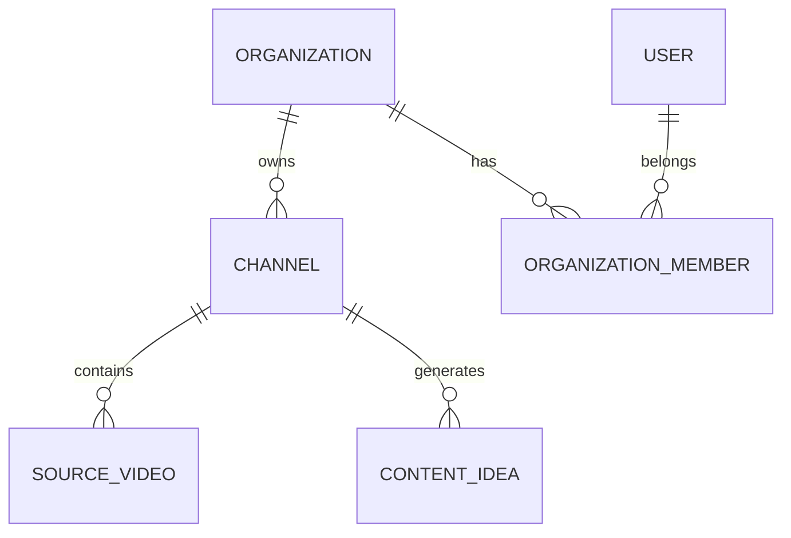

# Documento 03 — Modelo de Dados e Entidades do Sistema

## 1. Objetivo

Este documento define o modelo conceitual de dados da plataforma, as principais entidades, seus relacionamentos, responsabilidades, estados e regras de persistência.

O objetivo é permitir que o Claude Code construa o banco desde o início com uma visão completa do produto, sem tentar criar todas as tabelas e campos finais de uma só vez.

A regra é:

- criar agora apenas o que cada fase necessita;
- manter compatibilidade com as entidades futuras;
- evitar schemas improvisados;
- utilizar migrations em todas as alterações;
- preservar histórico e rastreabilidade;
- garantir isolamento multi-tenant.

---

# 2. Princípios do Modelo de Dados

Toda entidade de negócio deverá seguir, quando aplicável:

```text
id: UUID
organization_id: UUID

created_at: timestamptz
updated_at: timestamptz
deleted_at: timestamptz | null
```

Entidades que representam processos também poderão possuir:

```text
started_at
completed_at
failed_at
scheduled_at
published_at
```

Datas devem ser persistidas em UTC.

---

# 3. Multi-Tenancy

Estrutura principal:

```text
Organization
      │
      ├── Users
      │
      └── Channels
             │
             ├── Strategies
             ├── Ideas
             ├── Projects
             ├── Publications
             └── Analytics
```

Toda consulta de recurso privado deverá ser limitada por:

```text
organization_id
```

Um recurso pertencente a uma organização jamais poderá ser acessado por usuário de outra organização.

---

# 4. Mapa Geral das Entidades

A estrutura completa prevista é:

```text
IDENTITY
├── organizations
├── users
├── organization_members
└── audit_logs

CHANNELS
├── channels
├── channel_connections
├── channel_sync_runs
├── channel_profiles
├── channel_dna_versions
├── audience_profiles
└── brand_profiles

SOURCE CONTENT
├── source_videos
├── source_playlists
├── source_video_metrics
└── source_comments (future)

STRATEGY
├── content_strategies
├── content_pillars
├── strategy_rules
└── strategy_versions

IDEATION
├── content_ideas
├── content_opportunities
├── opportunity_scores
├── idea_relationships
└── content_clusters

CALENDAR
├── calendar_items
├── publishing_slots
└── calendar_recommendations

PROJECTS
├── content_projects
├── project_versions
├── project_assets
└── project_notes

SCRIPTING
├── scripts
├── script_versions
├── storyboards
├── scenes
├── scene_states
└── scene_transitions

BRAND / CHARACTERS
├── brand_assets
├── characters
├── character_references
├── character_voices
├── locations
└── visual_rules

AGENTS
├── agents
├── agent_versions
├── agent_prompts
└── agent_runs

WORKFLOWS
├── workflow_definitions
├── workflow_versions
├── workflow_runs
├── workflow_steps
└── workflow_events

AI / PROVIDERS
├── providers
├── provider_connections
├── ai_models
├── model_capabilities
├── provider_model_prices
└── provider_health_snapshots

GENERATIONS
├── generations
├── generation_attempts
├── generation_inputs
└── generation_outputs

ASSETS
├── media_assets
├── asset_relationships
└── asset_metadata

QUALITY
├── quality_reviews
├── quality_scores
├── quality_issues
└── repair_actions

SEO
├── seo_packages
├── title_candidates
├── thumbnail_candidates
└── metadata_versions

PUBLICATION
├── publications
├── publication_attempts
├── publication_schedules
└── publication_events

ANALYTICS
├── analytics_snapshots
├── video_metric_snapshots
├── channel_metric_snapshots
├── performance_baselines
└── performance_insights

LEARNING
├── learning_events
├── learned_rules
└── learning_evidence

BILLING / COSTS
├── subscriptions
├── plans
├── usage_events
├── cost_events
├── budgets
└── invoices (future)

SYSTEM
├── jobs
├── feature_flags
├── system_events
└── idempotency_keys
```

---

# 5. Organizations

Tabela:

```text
organizations
```

Representa a unidade principal de isolamento SaaS.

Campos iniciais:

```text
id
name
slug
status
timezone
created_at
updated_at
```

Status sugeridos:

```text
active
suspended
disabled
```

Uma organização poderá representar:

- um criador individual;
- uma agência;
- uma empresa;
- uma equipe.

---

# 6. Users

Tabela:

```text
users
```

Campos:

```text
id
email
name
password_hash
status
last_login_at
created_at
updated_at
```

Nunca armazenar senha em texto.

Status:

```text
active
pending
suspended
disabled
```

---

# 7. Organization Members

Tabela:

```text
organization_members
```

Relaciona:

```text
organization
+
user
```

Campos:

```text
id
organization_id
user_id
role
status
created_at
```

Roles iniciais:

```text
owner
admin
editor
viewer
```

Preparar arquitetura para permissões mais granulares futuramente.

---

# 8. Channels

Tabela:

```text
channels
```

Representa um canal gerenciado pela plataforma.

Campos previstos:

```text
id
organization_id

platform
external_channel_id

name
handle
description
language
country

thumbnail_url

status
automation_mode

connected_at
last_synced_at

created_at
updated_at
deleted_at
```

Inicialmente:

```text
platform = youtube
```

Mas não usar nomes de tabelas como:

```text
youtube_channels
```

para preservar expansão futura.

---

# 9. Automation Mode

Campo:

```text
channels.automation_mode
```

Enum:

```text
manual
assisted
semi_auto
autopilot
```

Novo canal deve iniciar como:

```text
assisted
```

ou configuração equivalente de baixa autonomia.

Nunca iniciar com auto-publicação irrestrita.

---

# 10. Channel Connections

Tabela:

```text
channel_connections
```

Responsável por armazenar conexão externa.

Campos:

```text
id
organization_id
channel_id

provider
external_account_id

access_token_encrypted
refresh_token_encrypted
token_expires_at

scopes
status

created_at
updated_at
```

Provider inicial:

```text
google_youtube
```

Não retornar tokens pela API da aplicação.

---

# 11. Channel Sync Runs

Tabela:

```text
channel_sync_runs
```

Registra importações.

Campos:

```text
id
organization_id
channel_id

sync_type

status

started_at
completed_at

items_discovered
items_created
items_updated

error_code
error_message

correlation_id
```

Tipos:

```text
initial
full
incremental
manual
```

---

# 12. Source Videos

Tabela:

```text
source_videos
```

Representa vídeos existentes no canal, inclusive conteúdos anteriores à plataforma.

Campos principais:

```text
id
organization_id
channel_id

external_video_id

title
description

video_type

duration_seconds
published_at

privacy_status

thumbnail_url

raw_metadata_json

created_at
updated_at
```

Tipos:

```text
short
long_form
live
unknown
```

Criar unique constraint:

```text
channel_id + external_video_id
```

---

# 13. Source Playlists

Tabela:

```text
source_playlists
```

Campos:

```text
id
organization_id
channel_id
external_playlist_id
title
description
item_count
raw_metadata_json
```

---

# 14. Source Video Metrics

Tabela histórica:

```text
source_video_metrics
```

Nunca sobrescrever dados históricos.

Campos:

```text
id
organization_id
channel_id
source_video_id

captured_at

views
likes
comments
watch_time_minutes
average_view_duration
average_view_percentage

subscribers_gained
subscribers_lost

impressions
impressions_ctr

raw_metrics_json
```

Campos específicos podem permanecer nulos caso a API não os forneça.

---

# 15. Channel Profile

Tabela:

```text
channel_profiles
```

Representa perfil operacional atual do canal.

Campos:

```text
id
organization_id
channel_id

primary_language
primary_category
estimated_audience
content_summary

confidence

generated_at
updated_at
```

Diferença:

```text
Channel Profile
= visão resumida atual
```

```text
Channel DNA
= conhecimento editorial profundo e versionado
```

---

# 16. Channel DNA Versions

Tabela crítica:

```text
channel_dna_versions
```

Campos:

```text
id
organization_id
channel_id

version

status

classification_json
audience_json
formats_json
content_patterns_json
performance_patterns_json
brand_rules_json
publishing_patterns_json
restrictions_json
recommendations_json

confidence

generated_by_agent_run_id

created_at
activated_at
```

Status:

```text
draft
active
superseded
```

Somente uma versão deverá estar ativa por canal.

---

# 17. Audience Profiles

Tabela:

```text
audience_profiles
```

Campos:

```text
id
organization_id
channel_id

version

profile_json

confidence
source

created_at
```

Source:

```text
youtube
user
inferred
mixed
```

---

# 18. Brand Profiles

Tabela:

```text
brand_profiles
```

Campos:

```text
id
organization_id
channel_id

name

colors_json
typography_json
visual_style_json
tone_of_voice_json
rules_json
prohibited_elements_json

created_at
updated_at
```

---

# 19. Content Strategies

Tabela:

```text
content_strategies
```

Representa estratégia editorial ativa.

Campos:

```text
id
organization_id
channel_id

name
version
status

objective
shorts_ratio
long_form_ratio
experimental_ratio

recommended_frequency_json
strategy_json

generated_by_agent_run_id

created_at
activated_at
```

Status:

```text
draft
active
archived
```

---

# 20. Content Pillars

Tabela:

```text
content_pillars
```

Campos:

```text
id
organization_id
channel_id
strategy_id

name
description

target_ratio
priority

active
```

Exemplo:

```text
Histórias     40%
Música        30%
Descoberta    20%
Experimental  10%
```

---

# 21. Strategy Rules

Tabela:

```text
strategy_rules
```

Permite armazenar regras explícitas.

Exemplo:

```text
Nunca publicar dois vídeos longos no mesmo dia.
```

Campos:

```text
id
organization_id
strategy_id

rule_type
rule_json
priority
active
```

---

# 22. Content Ideas

Tabela:

```text
content_ideas
```

Representa pauta ainda não necessariamente aprovada.

Campos:

```text
id
organization_id
channel_id

title
summary

idea_type

origin
status

recommended_format

generated_by_agent_run_id

created_at
updated_at
```

Origins:

```text
ai
trend
user
analytics
series
repurpose
```

Status:

```text
draft
evaluating
recommended
approved
rejected
archived
```

---

# 23. Content Opportunities

Tabela:

```text
content_opportunities
```

Representa uma ideia já contextualizada e avaliada.

Campos:

```text
id
organization_id
channel_id
idea_id

opportunity_score

recommended_format
recommended_duration
recommended_publish_window

reasoning_summary

status

created_at
```

---

# 24. Opportunity Scores

Tabela:

```text
opportunity_scores
```

Campos:

```text
id
organization_id
opportunity_id

score_type
score
weight
weighted_score
confidence

evidence_json
```

Tipos iniciais:

```text
channel_fit
audience_fit
trend
novelty
retention_potential
search_potential
competition
brand_fit
strategic_fit
```

Não armazenar apenas o score final.

Preservar os componentes.

---

# 25. Content Clusters

Tabela:

```text
content_clusters
```

Permite agrupar conteúdos relacionados.

Exemplo:

```text
Vídeo principal
├── Short 1
├── Short 2
└── Short 3
```

Campos:

```text
id
organization_id
channel_id

name
topic
status

created_at
```

---

# 26. Idea Relationships

Tabela:

```text
idea_relationships
```

Relaciona ideias.

Tipos:

```text
parent
child
related
repurpose
sequel
series
```

---

# 27. Calendar Items

Tabela:

```text
calendar_items
```

Campos:

```text
id
organization_id
channel_id

idea_id
project_id

content_type

planned_at

status

source

created_at
updated_at
```

Status:

```text
suggested
planned
approved
producing
ready
scheduled
published
cancelled
```

---

# 28. Publishing Slots

Tabela:

```text
publishing_slots
```

Representa janelas recomendadas recorrentes.

Exemplo:

```text
segunda
10:00
short
```

Campos:

```text
id
organization_id
channel_id

day_of_week
local_time
timezone

content_type
priority

active
```

---

# 29. Content Projects

Tabela central de produção:

```text
content_projects
```

Campos:

```text
id
organization_id
channel_id

idea_id
cluster_id
calendar_item_id

title
working_title

format

objective

target_duration_seconds

status

workflow_definition_id
workflow_run_id

budget_amount
budget_currency

created_at
updated_at
completed_at
```

Format:

```text
short
long_form
live
other
```

Status interno:

```text
planned
researching
scripting
storyboarding
producing
quality_review
repairing
ready
scheduled
publishing
published
failed
cancelled
human_review
```

---

# 30. Project Versions

Tabela:

```text
project_versions
```

Permite guardar alterações relevantes.

Campos:

```text
id
project_id
version
snapshot_json
created_at
created_by
```

Não é necessário versionar cada pequena atualização.

Utilizar em milestones importantes.

---

# 31. Scripts

Tabela:

```text
scripts
```

Campos:

```text
id
organization_id
project_id

current_version_id
status

created_at
updated_at
```

---

# 32. Script Versions

Tabela:

```text
script_versions
```

Campos:

```text
id
organization_id
script_id

version

hook
body
cta

estimated_duration_seconds

structured_script_json

generated_by_agent_run_id

quality_score

created_at
```

Nunca sobrescrever automaticamente versões anteriores.

---

# 33. Storyboards

Tabela:

```text
storyboards
```

Campos:

```text
id
organization_id
project_id

version
status

created_at
updated_at
```

---

# 34. Scenes

Tabela:

```text
scenes
```

Campos:

```text
id
organization_id
project_id
storyboard_id

scene_number

title
description

duration_seconds

visual_instruction
camera_instruction
motion_instruction
audio_instruction
dialogue

status

created_at
updated_at
```

Unique constraint:

```text
storyboard_id + scene_number
```

---

# 35. Scene State

Tabela:

```text
scene_states
```

Responsável pela continuidade.

Campos:

```text
id
organization_id
scene_id

characters_json
objects_json
environment_json
continuity_json

created_at
```

Exemplo:

```json
{
  "characters": {
    "tutu": {
      "location": "left",
      "holding": "golden_fruit",
      "emotion": "happy"
    }
  }
}
```

---

# 36. Scene Transitions

Tabela:

```text
scene_transitions
```

Campos:

```text
id
organization_id

from_scene_id
to_scene_id

transition_type
continuity_requirements_json

created_at
```

---

# 37. Characters

Tabela:

```text
characters
```

Campos:

```text
id
organization_id
channel_id

name
slug

species
apparent_age
gender_presentation

description
personality

canonical_prompt
negative_prompt

visual_rules_json
behavior_rules_json

active

created_at
updated_at
```

---

# 38. Character References

Tabela:

```text
character_references
```

Campos:

```text
id
organization_id
character_id
media_asset_id

reference_type
view_angle
priority

metadata_json
```

Reference types:

```text
front
side
back
expression
pose
outfit
style
other
```

---

# 39. Character Voices

Tabela:

```text
character_voices
```

Campos:

```text
id
organization_id
character_id

provider
external_voice_id

language
voice_description

settings_json

active
```

Nunca assumir que um provider específico sempre será utilizado.

---

# 40. Locations

Tabela:

```text
locations
```

Representa cenários recorrentes.

Campos:

```text
id
organization_id
channel_id

name
description

canonical_prompt

visual_rules_json

created_at
updated_at
```

---

# 41. Brand Assets

Tabela:

```text
brand_assets
```

Relaciona assets do canal.

Tipos:

```text
logo
watermark
font_reference
color_reference
intro
outro
```

Armazenar o arquivo como `MediaAsset`.

---

# 42. Agents

Tabela:

```text
agents
```

Campos:

```text
id
name
slug
category
description
active
```

Agents são globais à plataforma.

---

# 43. Agent Versions

Tabela:

```text
agent_versions
```

Campos:

```text
id
agent_id

version

provider
model

temperature
settings_json

input_schema_json
output_schema_json

prompt_id

status

created_at
```

---

# 44. Agent Prompts

Tabela:

```text
agent_prompts
```

Campos:

```text
id
agent_id
version

system_prompt
developer_prompt
template

checksum

created_at
```

---

# 45. Agent Runs

Tabela crítica:

```text
agent_runs
```

Campos:

```text
id
organization_id

agent_version_id

channel_id
project_id
scene_id

workflow_run_id
workflow_step_id

status

input_json
output_json

started_at
completed_at

tokens_input
tokens_output

estimated_cost
actual_cost

provider_request_id

correlation_id

error_code
error_message
```

---

# 46. Workflow Definitions

Tabela:

```text
workflow_definitions
```

Campos:

```text
id
name
slug
description
active
```

Exemplo:

```text
short.production
```

---

# 47. Workflow Versions

Tabela:

```text
workflow_versions
```

Campos:

```text
id
workflow_definition_id

version

definition_json

created_at
```

Exemplo:

```text
short.production.v1
```

---

# 48. Workflow Runs

Tabela:

```text
workflow_runs
```

Campos:

```text
id
organization_id

workflow_version_id

channel_id
project_id

status

current_step

started_at
completed_at

correlation_id

input_json
output_json

error_code
error_message
```

Status:

```text
pending
running
paused
completed
failed
cancelled
human_review
```

---

# 49. Workflow Steps

Tabela:

```text
workflow_steps
```

Campos:

```text
id
organization_id
workflow_run_id

step_key
sequence

status

started_at
completed_at

attempt_count

input_json
output_json

error_json
```

---

# 50. Workflow Events

Tabela:

```text
workflow_events
```

Campos:

```text
id
organization_id
workflow_run_id
workflow_step_id

event_type

payload_json

created_at

correlation_id
```

---

# 51. Providers

Tabela:

```text
providers
```

Representa gateways externos.

Campos:

```text
id
name
slug
provider_type
status
settings_json
created_at
```

Tipos:

```text
llm
media
voice
music
multi
```

Exemplos futuros:

```text
higgsfield
kie
fal
wavespeed
replicate
```

---

# 52. Provider Connections

Tabela:

```text
provider_connections
```

Representa credenciais da própria plataforma ou futuramente BYOK.

Campos:

```text
id
organization_id nullable

provider_id

credential_type

credentials_encrypted

status

created_at
updated_at
```

Se `organization_id` for null:

```text
credencial da plataforma
```

Se preenchido:

```text
credencial específica do cliente
```

---

# 53. AI Models

Tabela:

```text
ai_models
```

Campos:

```text
id
provider_id

external_model_id

name
category

status

quality_score
reliability_score
speed_score

metadata_json
```

---

# 54. Model Capabilities

Tabela:

```text
model_capabilities
```

Exemplos:

```text
text_generation
structured_output
image_generation
image_edit
text_to_video
image_to_video
text_to_speech
music_generation
upscale
```

Campos:

```text
id
model_id
capability
settings_json
```

---

# 55. Provider Model Prices

Tabela:

```text
provider_model_prices
```

Campos:

```text
id
provider_id
model_id

operation

unit
currency

price

valid_from
valid_until
```

Permite histórico de preço.

Nunca substituir silenciosamente preço anterior.

---

# 56. Provider Health Snapshots

Tabela:

```text
provider_health_snapshots
```

Campos:

```text
id
provider_id

status

latency_ms
success_rate
error_rate

captured_at
```

---

# 57. Generations

Tabela:

```text
generations
```

Representa uma solicitação lógica de geração.

Campos:

```text
id
organization_id

channel_id
project_id
scene_id

generation_type

status

selected_attempt_id

created_at
completed_at
```

Generation types:

```text
text
image
video
image_to_video
voice
music
thumbnail
upscale
edit
```

---

# 58. Generation Attempts

Tabela:

```text
generation_attempts
```

Campos:

```text
id
organization_id
generation_id

attempt_number

provider_id
model_id

status

input_json
output_json

provider_job_id

started_at
completed_at

estimated_cost
actual_cost

quality_score

error_code
error_message
```

Unique:

```text
generation_id + attempt_number
```

---

# 59. Media Assets

Tabela:

```text
media_assets
```

Campos:

```text
id
organization_id

channel_id
project_id
scene_id

asset_type

storage_provider
storage_key

mime_type
size_bytes
checksum

width
height
duration_seconds

metadata_json

created_at
deleted_at
```

Tipos:

```text
image
video
audio
voice
music
thumbnail
subtitle
render
reference
logo
```

---

# 60. Asset Relationships

Tabela:

```text
asset_relationships
```

Permite rastrear lineage.

Exemplo:

```text
image
↓
image_to_video
↓
video
```

Campos:

```text
id
source_asset_id
target_asset_id
relationship_type
```

Tipos:

```text
generated_from
edited_from
upscaled_from
derived_from
assembled_into
```

---

# 61. Quality Reviews

Tabela:

```text
quality_reviews
```

Campos:

```text
id
organization_id

project_id
scene_id
asset_id

review_type

status

final_score

reviewed_by_agent_run_id

created_at
```

Status:

```text
pending
passed
failed
repair_required
human_review
```

---

# 62. Quality Scores

Tabela:

```text
quality_scores
```

Campos:

```text
id
quality_review_id

score_type
score
weight
weighted_score
confidence

evidence_json
```

Tipos:

```text
brand
visual
audio
script
continuity
audience
seo
safety
retention
```

---

# 63. Quality Issues

Tabela:

```text
quality_issues
```

Campos:

```text
id
quality_review_id

issue_type
severity

description
location_json

recommended_action

status
```

Severity:

```text
info
low
medium
high
critical
```

---

# 64. Repair Actions

Tabela:

```text
repair_actions
```

Campos:

```text
id
organization_id

quality_issue_id

action_type

status

generation_id nullable
workflow_run_id nullable

created_at
completed_at
```

Ações:

```text
edit
regenerate
replace_audio
rewrite_script
reassemble
human_review
```

---

# 65. SEO Packages

Tabela:

```text
seo_packages
```

Campos:

```text
id
organization_id
project_id

version

selected_title_id
selected_thumbnail_id

description
keywords_json
hashtags_json
chapters_json

search_intent

score

created_at
```

---

# 66. Title Candidates

Tabela:

```text
title_candidates
```

Campos:

```text
id
seo_package_id

title
score

reasoning_summary

selected
```

---

# 67. Thumbnail Candidates

Tabela:

```text
thumbnail_candidates
```

Campos:

```text
id
seo_package_id
media_asset_id

headline
score

selected
```

---

# 68. Publications

Tabela:

```text
publications
```

Representa publicação lógica.

Campos:

```text
id
organization_id
channel_id
project_id

platform

status

external_content_id

title
description

published_at

created_at
updated_at
```

Status:

```text
draft
ready
scheduled
publishing
published
failed
cancelled
```

---

# 69. Publication Schedules

Tabela:

```text
publication_schedules
```

Campos:

```text
id
organization_id
publication_id

scheduled_at_utc
timezone
scheduled_local_time

status

created_at
```

---

# 70. Publication Attempts

Tabela:

```text
publication_attempts
```

Campos:

```text
id
publication_id

attempt_number

status

provider_response_json

started_at
completed_at

error_code
error_message

idempotency_key
```

Nunca permitir duplicação de upload por retry.

---

# 71. Publication Events

Tabela:

```text
publication_events
```

Exemplos:

```text
scheduled
started
uploaded
metadata_updated
published
failed
cancelled
```

---

# 72. Analytics Snapshots

Tabela genérica:

```text
analytics_snapshots
```

Campos:

```text
id
organization_id

channel_id
publication_id

snapshot_type
captured_at

metrics_json
dimensions_json
```

---

# 73. Video Metric Snapshots

Tabela especializada opcional:

```text
video_metric_snapshots
```

Campos:

```text
id
organization_id
publication_id

captured_at

views
likes
comments

watch_time_minutes
average_view_duration
average_view_percentage

impressions
ctr

subscribers_gained

traffic_sources_json
audience_retention_json
```

---

# 74. Channel Metric Snapshots

Tabela:

```text
channel_metric_snapshots
```

Campos:

```text
id
organization_id
channel_id

captured_at

subscribers
views
videos

metrics_json
```

---

# 75. Performance Baselines

Tabela:

```text
performance_baselines
```

Campos:

```text
id
organization_id
channel_id

baseline_type

sample_size

metrics_json

calculated_at
valid_until
```

Tipos:

```text
channel
short
long_form
topic
duration_bucket
content_pillar
```

---

# 76. Performance Insights

Tabela:

```text
performance_insights
```

Campos:

```text
id
organization_id
channel_id

insight_type

title
description

confidence
sample_size
effect_size

evidence_json

created_at
expires_at
```

---

# 77. Learning Events

Tabela:

```text
learning_events
```

Representa inferência criada pelo Learning Engine.

Campos:

```text
id
organization_id
channel_id

finding

confidence
sample_size
effect_size

evidence_json

status

created_at
```

Status:

```text
candidate
validated
rejected
expired
```

---

# 78. Learned Rules

Tabela:

```text
learned_rules
```

Transforma aprendizados suficientemente confiáveis em regras utilizáveis.

Exemplo:

```text
Para Shorts deste canal, priorizar duração entre 23 e 30 segundos.
```

Campos:

```text
id
organization_id
channel_id

rule_type
rule_json

confidence

source_learning_event_id

active

created_at
```

---

# 79. Plans

Tabela:

```text
plans
```

Para produto SaaS.

Campos:

```text
id
name
slug

monthly_price
currency

limits_json
features_json

active
```

Implementação completa somente na Fase 20.

---

# 80. Subscriptions

Tabela:

```text
subscriptions
```

Campos:

```text
id
organization_id
plan_id

status

current_period_start
current_period_end

external_subscription_id

created_at
```

---

# 81. Usage Events

Tabela:

```text
usage_events
```

Representa consumo contabilizável.

Campos:

```text
id
organization_id
channel_id
project_id

usage_type

quantity
unit

created_at
```

Exemplos:

```text
video_generated
image_generated
voice_second
storage_gb
publication
llm_tokens
```

---

# 82. Cost Events

Tabela crítica:

```text
cost_events
```

Campos:

```text
id
organization_id

channel_id
project_id
scene_id

provider_id
model_id

operation

quantity
unit

currency

estimated_cost
actual_cost

generation_attempt_id
agent_run_id

created_at
```

---

# 83. Budgets

Tabela:

```text
budgets
```

Pode ser aplicada em:

```text
organization
channel
project
```

Campos:

```text
id
organization_id

scope_type
scope_id

period_type

amount
currency

warning_threshold
hard_limit

active
```

---

# 84. Jobs

Tabela:

```text
jobs
```

Representa processos assíncronos visíveis à aplicação.

Campos:

```text
id
organization_id

job_type

resource_type
resource_id

status

progress_percent

started_at
completed_at

error_code
error_message

correlation_id
```

Status:

```text
pending
queued
running
completed
failed
cancelled
```

---

# 85. Feature Flags

Tabela:

```text
feature_flags
```

Campos:

```text
id

key

scope_type
scope_id

enabled

config_json

created_at
updated_at
```

Scopes:

```text
global
organization
channel
```

---

# 86. Audit Logs

Tabela:

```text
audit_logs
```

Campos:

```text
id
organization_id

actor_type
actor_id

action

resource_type
resource_id

metadata_json

ip_address nullable

created_at
```

Actor:

```text
user
system
agent
worker
```

---

# 87. Idempotency Keys

Tabela:

```text
idempotency_keys
```

Campos:

```text
id

organization_id

key
operation

resource_id

status

created_at
expires_at
```

Usar principalmente para:

- publicação;
- billing;
- geração crítica;
- webhooks;
- comandos externos.

---

# 88. Relacionamento Principal do Conteúdo

O fluxo central de dados deverá ser:

```text
Channel
   ↓
Channel DNA
   ↓
Content Strategy
   ↓
Content Idea
   ↓
Content Opportunity
   ↓
Calendar Item
   ↓
Content Project
   ↓
Script
   ↓
Storyboard
   ↓
Scenes
   ↓
Generations
   ↓
Media Assets
   ↓
Quality Reviews
   ↓
SEO Package
   ↓
Publication
   ↓
Analytics
   ↓
Learning Events
   ↓
Channel DNA / Strategy
```

---

# 89. Relacionamento de Produção

```text
Content Project
      │
      ├── Script
      │     └── Script Versions
      │
      ├── Storyboard
      │     └── Scenes
      │            │
      │            ├── Scene State
      │            ├── Generations
      │            └── Assets
      │
      ├── Quality Reviews
      │
      ├── SEO Package
      │
      └── Publication
```

---

# 90. Relacionamento dos Agentes

```text
Workflow Run
      ↓
Workflow Step
      ↓
Agent Run
      ↓
Agent Version
      ↓
Agent
```

Um Agent Run poderá gerar:

- Channel DNA;
- Idea;
- Script Version;
- Quality Review;
- SEO Candidate;
- Learning Event.

---

# 91. Relacionamento das Gerações

```text
Generation
    ↓
Generation Attempt #1
    ↓ fail

Generation Attempt #2
    ↓ pass

Selected Attempt
    ↓
Media Asset
```

Nunca apagar attempts falhos.

Eles serão importantes para:

- custo;
- debugging;
- avaliação de providers;
- cálculo de approval rate.

---

# 92. Provider Performance Futuro

A partir de `generation_attempts`, o sistema deverá poder calcular:

```text
Provider A

generation success rate
QA approval rate
average latency
average cost
cost per approved asset
```

Isso alimentará o Media Router.

---

# 93. Source vs Generated Content

Distinguir claramente:

```text
source_videos
```

Vídeos importados do canal.

de:

```text
content_projects
```

Conteúdo criado/gerenciado pela plataforma.

Quando um Content Project for publicado:

```text
Publication.external_content_id
```

deverá apontar para o vídeo criado no YouTube.

Depois ele também poderá ser sincronizado como source video sem causar duplicidade lógica.

---

# 94. Dados Estruturados vs JSON

Usar campos normais para dados que serão:

- filtrados;
- ordenados;
- agregados;
- indexados;
- relacionados.

Usar JSONB para:

- estruturas altamente variáveis;
- metadata de providers;
- respostas externas;
- configurações;
- snapshots de IA.

Não transformar todo o banco em JSON.

---

# 95. JSONB

Utilizar PostgreSQL JSONB.

Não usar texto serializado manualmente para estruturas JSON.

---

# 96. Dados Brutos de APIs

Quando útil, preservar:

```text
raw_metadata_json
raw_metrics_json
provider_response_json
```

Isso facilita:

- debugging;
- novas análises;
- compatibilidade futura.

Esses campos não substituem os dados normalizados.

---

# 97. Índices Prioritários

Planejar índices para:

```text
organization_id
channel_id
project_id

status

created_at
updated_at

scheduled_at
published_at

external_video_id

workflow_run_id

correlation_id
```

---

# 98. Unique Constraints Prioritárias

Criar, quando aplicável:

```text
organization_members
organization_id + user_id

channels
organization_id + platform + external_channel_id

source_videos
channel_id + external_video_id

source_playlists
channel_id + external_playlist_id

scenes
storyboard_id + scene_number

generation_attempts
generation_id + attempt_number

publication_attempts
publication_id + attempt_number
```

---

# 99. Foreign Keys

Utilizar foreign keys reais no PostgreSQL.

Não depender apenas da aplicação para integridade referencial.

---

# 100. Cascade Delete

Evitar cascades destrutivos excessivos.

Preferir:

```text
RESTRICT
SET NULL
soft delete
```

para entidades críticas.

Conteúdo histórico não deverá desaparecer porque uma entidade pai foi desativada.

---

# 101. Histórico

Entidades que devem preservar histórico:

```text
Channel DNA
Strategy
Scripts
Workflows
Agents
Prompts
Provider Prices
Analytics
Learning Events
Generation Attempts
Publication Attempts
```

---

# 102. Dados Imutáveis

Alguns registros deverão ser tratados como append-only após finalização.

Exemplos:

```text
cost_events
audit_logs
analytics snapshots
workflow events
publication events
```

Correções devem gerar novo evento, não sobrescrever histórico.

---

# 103. Provenance

Para informações geradas ou inferidas, guardar quando possível:

```text
source_type
source_id
agent_run_id
confidence
```

Isso permite responder futuramente:

```text
Por que o sistema acha que este tema funciona?
```

---

# 104. User Override

Nunca apagar inferência da IA quando usuário corrigir.

Exemplo:

```text
AI:
Primary category = Education

User:
Primary category = Kids Entertainment
```

Guardar:

```text
inferred_value
user_override
effective_value
```

quando aplicável.

---

# 105. Estados Simplificados na Interface

Internamente:

```text
researching
scripting
storyboarding
generating
rendering
quality_review
repairing
ready
```

Interface poderá mostrar apenas:

```text
Produzindo
```

Criar mapeamento de estado interno para estado de UI.

---

# 106. Status Não Devem Ser Livres

Todos os status devem utilizar enums versionados.

Evitar:

```text
status = "almost done"
```

---

# 107. Eventos de Domínio

Mudanças importantes deverão poder criar eventos.

Exemplo:

```text
idea.approved
```

payload:

```json
{
  "idea_id": "...",
  "channel_id": "...",
  "approved_by": "user",
  "timestamp": "..."
}
```

---

# 108. Correlation ID

Todo processo iniciado por um evento relevante deverá possuir um correlation ID.

Exemplo:

```text
Usuário aprova ideia
      ↓
correlation_id = ABC
      ↓
project
workflow
script
generations
quality
publication
```

Tudo rastreável pelo mesmo identificador.

---

# 109. Fases e Criação das Entidades

Não criar todas as tabelas na primeira migration.

Criar progressivamente.

---

# 110. Fase 01

Criar apenas infraestrutura mínima.

Possivelmente nenhuma entidade completa além do necessário para health/config.

---

# 111. Fase 02 — Core Domain

Criar:

```text
organizations
users
organization_members
channels
audit_logs
feature_flags
jobs
```

Além de bases comuns e enums fundamentais.

---

# 112. Fase 03 — Authentication

Complementar:

```text
users
organization_members
sessions/tokens conforme implementação
audit_logs
```

---

# 113. Fase 04 — YouTube Integration

Criar:

```text
channel_connections
channel_sync_runs
```

---

# 114. Fase 05 — Channel Importer

Criar:

```text
source_videos
source_playlists
source_video_metrics
```

---

# 115. Fase 06 — Channel Intelligence

Criar:

```text
channel_profiles
audience_profiles
```

---

# 116. Fase 07 — Channel DNA

Criar:

```text
channel_dna_versions
brand_profiles
```

---

# 117. Fase 08 — Strategy Engine

Criar:

```text
content_strategies
content_pillars
strategy_rules
```

---

# 118. Fase 09 — Ideas & Opportunities

Criar:

```text
content_ideas
content_opportunities
opportunity_scores
content_clusters
idea_relationships
```

---

# 119. Fase 10 — Calendar

Criar:

```text
calendar_items
publishing_slots
calendar_recommendations
```

---

# 120. Fase 11 — Workflow & Agents

Criar:

```text
agents
agent_versions
agent_prompts
agent_runs

workflow_definitions
workflow_versions
workflow_runs
workflow_steps
workflow_events
```

---

# 121. Fase 12 — Script & Storyboard

Criar:

```text
content_projects
project_versions

scripts
script_versions

storyboards
scenes
scene_states
scene_transitions

characters
character_references
character_voices
locations
brand_assets
```

---

# 122. Fase 13 — MCP / Media Gateway

Criar:

```text
providers
provider_connections
ai_models
model_capabilities
provider_model_prices
provider_health_snapshots

generations
generation_attempts
```

---

# 123. Fase 14 — Router & Costs

Criar/complementar:

```text
cost_events
budgets
usage_events
```

---

# 124. Fase 15 — Production

Criar:

```text
media_assets
asset_relationships
project_assets
```

---

# 125. Fase 16 — Quality Gate

Criar:

```text
quality_reviews
quality_scores
quality_issues
repair_actions
```

---

# 126. Fase 17 — SEO

Criar:

```text
seo_packages
title_candidates
thumbnail_candidates
metadata_versions
```

---

# 127. Fase 18 — Publishing

Criar:

```text
publications
publication_schedules
publication_attempts
publication_events
idempotency_keys
```

---

# 128. Fase 19 — Analytics & Learning

Criar:

```text
analytics_snapshots
video_metric_snapshots
channel_metric_snapshots
performance_baselines
performance_insights

learning_events
learned_rules
learning_evidence
```

---

# 129. Fase 20 — SaaS

Criar/completar:

```text
plans
subscriptions
billing integration
usage limits
administrative data
```

---

# 130. Regra de Migration

Toda fase deverá gerar migration independente e claramente identificável.

Exemplo:

```text
001_core_domain
002_authentication
003_youtube_connections
004_source_content
...
```

Não usar exatamente estes números se o Alembic utilizar IDs próprios, mas manter mensagem clara.

---

# 131. Seed Inicial

A aplicação deverá poder criar automaticamente dados básicos.

Exemplos:

```text
default roles
default feature flags
default workflow definitions
default agent registry
```

Na fase correspondente.

---

# 132. Dados de Desenvolvimento

Criar factories ou fixtures para:

```text
organization
user
channel
idea
project
```

Sem depender de canal real para desenvolver telas.

---

# 133. ERD

Claude Code deverá manter em:

```text
/docs/database.md
```

um diagrama atualizado das entidades implementadas.

Pode utilizar Mermaid.

Exemplo:



Atualizar o ERD em cada fase que alterar o domínio.

---

# 134. Regra de Não Implementação Antecipada

A existência de uma entidade neste documento não significa que deverá ser criada agora.

Este documento define o destino arquitetural.

A implementação deve acompanhar as 20 fases.

---

# 135. Regra de Compatibilidade

Ao criar uma entidade em uma fase anterior, considerar seus relacionamentos futuros.

Por exemplo:

`channels` deve nascer com UUID e organization_id desde o início porque futuramente será relacionado com dezenas de módulos.

---

# 136. Regra de Simplicidade

Evitar criar dezenas de colunas prematuramente.

Pode iniciar com:

```text
metadata_json
```

para dados ainda instáveis.

Quando determinado dado se tornar estrutural e consultável, criar migration e promover para coluna normalizada.

---

# 137. Regra Final do Banco

O modelo de dados deverá possibilitar responder perguntas como:

```text
Quem criou este conteúdo?

Qual agente sugeriu esta ideia?

Qual versão do prompt foi usada?

Qual modelo gerou esta cena?

Quanto custou?

Quantas tentativas foram necessárias?

Qual asset foi utilizado?

Por que o QA reprovou?

Quem aprovou?

Quando foi publicado?

Como performou?

O que o sistema aprendeu?

Esse aprendizado influenciou qual conteúdo futuro?
```

Se a arquitetura não permitir rastrear essas respostas, o modelo de dados está incompleto.

---

# 138. Resultado Esperado

Ao final das 20 fases, a cadeia completa deverá ser rastreável:

```text
ORGANIZATION
      ↓
CHANNEL
      ↓
CHANNEL DNA
      ↓
STRATEGY
      ↓
IDEA
      ↓
OPPORTUNITY
      ↓
CALENDAR
      ↓
PROJECT
      ↓
WORKFLOW
      ↓
AGENTS
      ↓
SCRIPT
      ↓
STORYBOARD
      ↓
SCENES
      ↓
GENERATIONS
      ↓
ASSETS
      ↓
QUALITY
      ↓
SEO
      ↓
PUBLICATION
      ↓
ANALYTICS
      ↓
LEARNING
      ↓
NEW STRATEGY / IDEAS
```

O banco de dados deve ser a memória operacional permanente desse ciclo.

---

# 139. Instrução Final ao Claude Code

Antes de implementar qualquer fase que altere persistência:

1. consultar este documento;
2. identificar quais entidades pertencem à fase atual;
3. verificar relacionamentos com entidades existentes;
4. propor migration;
5. preservar compatibilidade;
6. implementar models;
7. implementar schemas;
8. implementar repositories;
9. criar índices e constraints;
10. criar testes;
11. atualizar `/docs/database.md`;
12. atualizar o ERD;
13. executar migrations em banco limpo;
14. testar upgrade de banco existente;
15. confirmar que nenhuma entidade de fase futura foi implementada desnecessariamente.

Este documento deverá permanecer como referência durante todo o desenvolvimento.