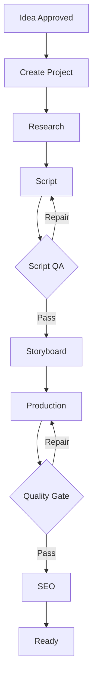

# Documento 04 — Workflows, Estados, Automações e Orquestração

## 1. Objetivo

Este documento define **como o sistema se comporta operacionalmente**.

Os Documentos 01–03 definiram:

```text
Documento 01 → o produto
Documento 02 → a arquitetura
Documento 03 → os dados
Documento 04 → o comportamento
```

Este documento deverá orientar o Claude Code na implementação de:

- workflows;
- máquinas de estado;
- eventos;
- jobs assíncronos;
- agentes;
- aprovações;
- retries;
- fallbacks;
- Quality Gates;
- agendamentos;
- publicação;
- analytics;
- aprendizado;
- Autopilot.

A plataforma deverá ser orientada por workflows explícitos e rastreáveis.

---

# 2. Princípio Fundamental

Nenhum processo importante deverá depender de uma sequência implícita de chamadas.

Evitar:

```text
endpoint
  ↓
função
  ↓
outra função
  ↓
outra função
  ↓
LLM
  ↓
provider
  ↓
publicação
```

Utilizar:

```text
EVENT
  ↓
WORKFLOW
  ↓
STEP
  ↓
RESULT
  ↓
EVENT
  ↓
NEXT STEP
```

---

# 3. Workflow Engine

Criar conceito de:

```text
WorkflowDefinition
WorkflowVersion
WorkflowRun
WorkflowStep
WorkflowEvent
```

Exemplo:

```text
WorkflowDefinition:
channel.onboarding

Version:
v1

WorkflowRun:
run_abc123
```

---

# 4. Requisitos de um Workflow

Todo Workflow Run deverá saber:

```text
qual workflow está executando;
qual versão;
qual organização;
qual canal;
qual projeto;
quem iniciou;
quando começou;
estado atual;
step atual;
steps concluídos;
tentativas;
custos;
erros;
correlation_id;
quando terminou.
```

---

# 5. Estados Gerais de Workflow

Utilizar inicialmente:

```text
PENDING
QUEUED
RUNNING
WAITING
PAUSED
HUMAN_REVIEW
COMPLETED
FAILED
CANCELLED
```

`WAITING` significa que o workflow aguarda algo externo.

Exemplos:

```text
provider processando vídeo
horário de publicação
analytics futuro
```

---

# 6. Estados de Workflow Step

```text
PENDING
QUEUED
RUNNING
COMPLETED
FAILED
SKIPPED
WAITING
RETRYING
HUMAN_REVIEW
CANCELLED
```

---

# 7. Transições Válidas

Exemplo:

```text
PENDING
   ↓
QUEUED
   ↓
RUNNING
   ├── COMPLETED
   ├── WAITING
   ├── RETRYING
   ├── HUMAN_REVIEW
   └── FAILED
```

Não permitir alterações arbitrárias de status.

---

# 8. Eventos

Eventos deverão seguir:

```text
domain.resource.action
```

Exemplos:

```text
channel.connection.created
channel.sync.completed

channel.analysis.completed
channel.dna.activated

strategy.activated

idea.generated
idea.approved

calendar.item.approved

project.created

script.generated
script.approved

scene.generated

quality.failed
quality.passed

publication.scheduled
publication.published

analytics.snapshot.created

learning.rule.validated
```

---

# 9. Event Envelope

Estrutura padrão:

```json
{
  "event_id": "uuid",
  "event_type": "idea.approved",
  "event_version": 1,

  "organization_id": "uuid",
  "channel_id": "uuid",

  "resource_type": "content_idea",
  "resource_id": "uuid",

  "actor_type": "user",
  "actor_id": "uuid",

  "correlation_id": "uuid",

  "occurred_at": "UTC timestamp",

  "payload": {}
}
```

---

# 10. Actor Types

```text
user
system
agent
worker
scheduler
webhook
```

---

# 11. Correlation ID

Um processo completo deverá ser rastreável.

Exemplo:

```text
IDEA APPROVED
correlation_id = XYZ

      ↓

PROJECT
XYZ

      ↓

SCRIPT
XYZ

      ↓

MEDIA
XYZ

      ↓

QA
XYZ

      ↓

PUBLICATION
XYZ
```

---

# 12. Workflow 01 — Channel Onboarding

Nome:

```text
channel.onboarding.v1
```

Trigger:

```text
channel.connection.created
```

Fluxo:

```text
CONNECT CHANNEL
      ↓
VALIDATE CONNECTION
      ↓
IMPORT CHANNEL
      ↓
IMPORT CONTENT
      ↓
IMPORT ANALYTICS
      ↓
ANALYZE CHANNEL
      ↓
BUILD AUDIENCE PROFILE
      ↓
BUILD CHANNEL DNA
      ↓
BUILD STRATEGY
      ↓
GENERATE INITIAL IDEAS
      ↓
SCORE OPPORTUNITIES
      ↓
BUILD INITIAL CALENDAR
      ↓
ONBOARDING COMPLETE
```

---

# 13. Onboarding — UX

Para o usuário mostrar apenas:

```text
Conectando canal
      ↓
Analisando conteúdo
      ↓
Entendendo sua audiência
      ↓
Preparando estratégia
      ↓
Criando sugestões
      ↓
Pronto
```

Não mostrar os steps técnicos.

---

# 14. Onboarding — Falha Parcial

Nem toda falha deve destruir onboarding.

Exemplo:

```text
IMPORT ANALYTICS
       ↓
analytics temporariamente indisponível
       ↓
DEGRADED
       ↓
continua usando dados disponíveis
```

O sistema poderá criar:

```text
Channel DNA confidence = 0.71
```

e atualizar posteriormente.

---

# 15. Onboarding Completo

Evento:

```text
channel.onboarding.completed
```

Deverá resultar em:

```text
Channel Profile
Audience Profile
Channel DNA
Content Strategy
Content Opportunities
Initial Calendar
```

---

# 16. Workflow 02 — Channel Synchronization

Nome:

```text
channel.sync.v1
```

Triggers:

```text
scheduler
user request
channel connection
```

Tipos:

```text
initial
incremental
full
```

---

# 17. Incremental Sync

Após onboarding:

```text
buscar apenas alterações relevantes
```

Evitar importar todo histórico repetidamente.

---

# 18. Channel Sync Flow

```text
START
  ↓
VALIDATE TOKEN
  ↓
REFRESH TOKEN IF REQUIRED
  ↓
FETCH CHANNEL
  ↓
FETCH NEW/UPDATED CONTENT
  ↓
FETCH METRICS
  ↓
NORMALIZE
  ↓
UPSERT
  ↓
UPDATE LAST_SYNC
  ↓
COMPLETE
```

---

# 19. Idempotência do Sync

Executar o mesmo sync duas vezes não poderá duplicar:

```text
vídeos
playlists
métricas equivalentes
```

---

# 20. Workflow 03 — Channel Intelligence Refresh

Nome:

```text
channel.intelligence.refresh.v1
```

Não recalcular Channel DNA a cada pequena mudança.

Triggers possíveis:

```text
onboarding
scheduled refresh
significant performance change
manual request
minimum new content threshold
```

---

# 21. Intelligence Flow

```text
COLLECT CURRENT DATA
       ↓
COMPARE PREVIOUS PROFILE
       ↓
ANALYZE CONTENT
       ↓
ANALYZE AUDIENCE
       ↓
ANALYZE PERFORMANCE
       ↓
CREATE DNA CANDIDATE
       ↓
COMPARE WITH ACTIVE DNA
       ↓
SIGNIFICANT CHANGE?
       ↓
YES → NEW DNA VERSION
NO  → KEEP CURRENT
```

---

# 22. Evitar Instabilidade Editorial

Um vídeo viral isolado não deverá mudar toda a estratégia.

Considerar:

```text
sample_size
confidence
recency
effect_size
historical consistency
```

---

# 23. Workflow 04 — Strategy Refresh

Nome:

```text
strategy.refresh.v1
```

Inputs:

```text
Channel DNA
Audience Profile
Performance Baseline
Learned Rules
Existing Strategy
```

Output:

```text
Strategy Candidate
```

---

# 24. Estratégia Não Deve Mudar Silenciosamente

Mudanças relevantes devem gerar:

```text
strategy.candidate.created
```

Dependendo do modo:

```text
ASSISTED
→ usuário aprova

SEMI_AUTO
→ pequenas mudanças automáticas

AUTOPILOT
→ aplicar dentro das políticas permitidas
```

---

# 25. Workflow 05 — Idea Discovery

Nome:

```text
ideas.discovery.v1
```

Trigger:

```text
calendar inventory below threshold
manual request
scheduled planning cycle
new trend
strategy update
```

---

# 26. Idea Discovery Context

Obrigatoriamente considerar:

```text
Channel DNA
Audience Profile
Content Strategy
Content Pillars
Recent Content
Planned Content
Performance History
Learned Rules
Trend Signals
Seasonality
```

---

# 27. Idea Discovery Flow

```text
COLLECT CONTEXT
      ↓
IDENTIFY CONTENT GAPS
      ↓
COLLECT TREND SIGNALS
      ↓
GENERATE CANDIDATES
      ↓
REMOVE DUPLICATES
      ↓
CHECK RECENT CONTENT
      ↓
SCORE CANDIDATES
      ↓
RANK
      ↓
SAVE OPPORTUNITIES
```

---

# 28. Evitar Repetição

Antes de aprovar uma ideia, comparar com:

```text
conteúdo publicado
conteúdo planejado
conteúdo em produção
ideias recentes
```

---

# 29. Semantic Similarity

Preparar arquitetura para futura detecção semântica de duplicidade.

Exemplo:

```text
"Por que gatos enxergam no escuro?"

vs.

"Como os gatos conseguem ver à noite?"
```

Não considerar apenas comparação textual exata.

---

# 30. Workflow 06 — Opportunity Evaluation

Nome:

```text
opportunity.evaluate.v1
```

Scores:

```text
Channel Fit
Audience Fit
Strategic Fit
Trend
Novelty
Retention Potential
Search Potential
Competition
Brand Fit
Production Feasibility
```

---

# 31. Production Feasibility

Adicionar score específico.

Exemplo:

Uma ideia excelente pode exigir produção inviável para o orçamento atual.

Avaliar:

```text
complexidade
quantidade de cenas
custo estimado
modelos necessários
tempo de produção
assets disponíveis
```

---

# 32. Opportunity Score

Não utilizar apenas média simples.

Estrutura:

```text
FINAL SCORE =
Σ(score × weight)
```

Pesos deverão ser configuráveis.

---

# 33. Confidence

Além do score:

```text
Opportunity Score = 91
Confidence = 0.82
```

---

# 34. Workflow 07 — Calendar Planning

Nome:

```text
calendar.plan.v1
```

Inputs:

```text
Strategy
Opportunities
Existing Calendar
Publishing Slots
Content Mix
Clusters
Campaigns
```

---

# 35. Calendar Flow

```text
LOAD STRATEGY
      ↓
LOAD OPEN SLOTS
      ↓
LOAD OPPORTUNITIES
      ↓
BALANCE CONTENT PILLARS
      ↓
BALANCE FORMATS
      ↓
CHECK DUPLICATION
      ↓
CHECK CLUSTERS
      ↓
ASSIGN DATES
      ↓
CREATE RECOMMENDATIONS
```

---

# 36. Calendário Inicial

Após onboarding, sugerir um horizonte configurável.

Exemplo inicial:

```text
7 dias
```

Posteriormente:

```text
14
30
60 dias
```

---

# 37. Calendar Approval

No modo Assisted:

```text
AI Calendar
      ↓
USER REVIEW
      ↓
APPROVE
```

Ao aprovar:

```text
calendar.item.approved
```

---

# 38. Workflow 08 — Content Project Creation

Trigger:

```text
calendar.item.approved
```

Flow:

```text
CREATE PROJECT
      ↓
ASSIGN STRATEGY CONTEXT
      ↓
ASSIGN BUDGET
      ↓
SELECT WORKFLOW
      ↓
START PRODUCTION
```

---

# 39. Seleção de Workflow

Exemplos:

```text
short.production.v1
longform.production.v1
music_video.production.v1
kids_story.production.v1
```

Não obrigar todo conteúdo a utilizar pipeline idêntico.

---

# 40. Workflow 09 — Short Production

Nome:

```text
short.production.v1
```

Fluxo:

```text
PROJECT
  ↓
RESEARCH
  ↓
HOOK
  ↓
SCRIPT
  ↓
SCRIPT QA
  ↓
STORYBOARD
  ↓
SCENE PLANNING
  ↓
MEDIA PLAN
  ↓
MEDIA GENERATION
  ↓
VOICE
  ↓
AUDIO
  ↓
ASSEMBLY
  ↓
RENDER
  ↓
QUALITY GATE
  ↓
SEO
  ↓
THUMBNAIL IF REQUIRED
  ↓
FINAL REVIEW
  ↓
READY
```

---

# 41. Workflow 10 — Long-form Production

Nome:

```text
longform.production.v1
```

Fluxo:

```text
PROJECT
 ↓
DEEP RESEARCH
 ↓
OUTLINE
 ↓
SCRIPT
 ↓
FACT / CONTENT REVIEW
 ↓
SCRIPT QA
 ↓
STORYBOARD
 ↓
SCENE BREAKDOWN
 ↓
MEDIA PLAN
 ↓
PARALLEL GENERATION
 ↓
VOICE
 ↓
AUDIO
 ↓
ASSEMBLY
 ↓
RENDER
 ↓
QUALITY GATE
 ↓
SEO
 ↓
THUMBNAIL
 ↓
FINAL REVIEW
 ↓
READY
```

---

# 42. Parallel Scene Production

Cenas independentes poderão ser produzidas em paralelo.

Exemplo:

```text
Scene 01 ─┐
Scene 02 ─┤
Scene 03 ─┼→ Assembly
Scene 04 ─┤
Scene 05 ─┘
```

Mas respeitar dependências de continuidade.

---

# 43. Scene Dependency Graph

Permitir dependências.

Exemplo:

```text
Scene 01
   ↓
Scene 02

Scene 03 ─ independent
```

Scene 03 pode ser gerada enquanto Scene 02 aguarda.

---

# 44. Media Planning

Antes de gerar mídia, criar:

```text
MediaPlan
```

Conceitualmente:

```text
Scene 01
image_to_video
quality = high
budget = medium

Scene 02
static_image + camera motion

Scene 03
text_to_video
quality = premium
```

---

# 45. Não Gerar Tudo com Modelo Premium

Media Director deverá decidir quando utilizar:

```text
premium
standard
economy
```

conforme importância da cena.

---

# 46. Hero Scenes

Permitir marcar:

```text
hero_scene = true
```

Hero scenes poderão receber:

```text
maior orçamento
modelo premium
QA mais rigoroso
mais tentativas
```

---

# 47. Workflow 11 — Media Generation

Nome:

```text
media.generate.v1
```

Flow:

```text
RECEIVE MEDIA REQUEST
      ↓
VALIDATE
      ↓
CHECK BUDGET
      ↓
SELECT CAPABILITY
      ↓
MEDIA ROUTER
      ↓
SELECT PROVIDER/MODEL
      ↓
ESTIMATE COST
      ↓
CREATE GENERATION
      ↓
CREATE ATTEMPT
      ↓
SUBMIT
      ↓
WAIT PROVIDER
      ↓
DOWNLOAD RESULT
      ↓
VALIDATE FILE
      ↓
REGISTER ASSET
      ↓
QA
```

---

# 48. Media Router

Critérios:

```text
capability
quality
cost
speed
provider health
historical approval rate
character consistency
resolution
duration
```

---

# 49. Provider Selection

Não selecionar apenas pelo menor preço.

Exemplo:

```text
Provider A
$0.30
QA approval 55%

Provider B
$0.42
QA approval 94%
```

Provider B pode possuir menor custo real por asset aprovado.

---

# 50. Cost Per Approved Asset

Preparar métrica:

```text
total generation cost
──────────────────────
approved assets
```

---

# 51. Provider Failure

Se provider falhar:

```text
ATTEMPT 1
Provider A
↓ fail

ATTEMPT 2
Provider A
↓ fail

ROUTER
↓
Provider B
```

A política deverá ser configurável.

---

# 52. Budget Guard

Antes de nova tentativa:

```text
CURRENT COST
+
NEXT ESTIMATED COST
≤
BUDGET?
```

Se não:

```text
STOP
↓
budget.exceeded
↓
HUMAN REVIEW
```

ou fallback econômico.

---

# 53. Workflow 12 — Quality Gate

Nome:

```text
quality.gate.v1
```

Pode operar em:

```text
script
scene
asset
final_video
metadata
```

---

# 54. Quality Dimensions

Avaliações possíveis:

```text
Brand
Visual
Audio
Script
Continuity
Audience
Safety
SEO
Retention
Technical
```

---

# 55. Quality Thresholds

Exemplo inicial configurável:

```text
90–100 PASS
80–89 REPAIR
70–79 REGENERATE
<70 HUMAN REVIEW / REGENERATE
```

Não hardcode esses valores na regra de negócio.

Utilizar configuração/policy.

---

# 56. Critical Failures

Algumas falhas devem reprovar independentemente da média.

Exemplos:

```text
conteúdo inseguro
personagem errado
violação grave da marca
arquivo corrompido
áudio ausente quando obrigatório
conteúdo diferente da pauta
```

---

# 57. Quality Gate Flow

```text
ASSET
 ↓
TECHNICAL QA
 ↓
CONTENT QA
 ↓
BRAND QA
 ↓
CONTINUITY QA
 ↓
SAFETY QA
 ↓
CALCULATE SCORE
 ↓
DECISION
```

---

# 58. Quality Decision

```text
PASS
      ↓
NEXT STEP

REPAIR
      ↓
TARGETED REPAIR

REGENERATE
      ↓
NEW GENERATION ATTEMPT

HUMAN REVIEW
      ↓
PAUSE
```

---

# 59. Targeted Repair

Preferir corrigir somente o problema.

Exemplo:

```text
vídeo correto
+
áudio ruim
```

Não regenerar vídeo.

Executar:

```text
replace_audio
```

---

# 60. Retry Policy

Política inicial:

```text
Attempt 1
→ same model repair/regenerate

Attempt 2
→ alternate model/provider

Attempt 3
→ human review
```

Configurável por workflow.

---

# 61. Retry Budget

Cada retry deve verificar:

```text
max_attempts
max_cost
max_duration
```

---

# 62. Workflow 13 — Final Video Assembly

Nome:

```text
video.assembly.v1
```

Flow:

```text
VALIDATE SCENES
      ↓
VALIDATE AUDIO
      ↓
VALIDATE ORDER
      ↓
ASSEMBLE
      ↓
TRANSITIONS
      ↓
SUBTITLES
      ↓
AUDIO MIX
      ↓
FINAL RENDER
      ↓
TECHNICAL VALIDATION
      ↓
FINAL QA
```

---

# 63. Render Validation

Verificar:

```text
arquivo abre
codec
resolução
aspect ratio
duration
audio stream
file size
frame integrity
```

---

# 64. Formatos

Preparar profiles:

```text
youtube_short
youtube_longform
```

Posteriormente:

```text
tiktok
instagram_reel
facebook_reel
```

---

# 65. Workflow 14 — SEO

Nome:

```text
seo.optimize.v1
```

Inputs:

```text
project
script
channel dna
strategy
audience
historical performance
search intent
```

Outputs:

```text
title candidates
description
keywords
hashtags
chapters
metadata
```

---

# 66. Title Candidates

Gerar múltiplos candidatos.

Exemplo:

```text
A
B
C
```

Avaliar:

```text
clarity
channel fit
curiosity
search relevance
click potential
accuracy
```

---

# 67. Proibir Clickbait Enganoso

O título deverá refletir o conteúdo real.

O sistema deverá diferenciar:

```text
curiosity
```

de:

```text
deceptive clickbait
```

---

# 68. Workflow 15 — Thumbnail

Nome:

```text
thumbnail.generate.v1
```

Flow:

```text
ANALYZE CONTENT
      ↓
ANALYZE CHANNEL STYLE
      ↓
CREATE CONCEPTS
      ↓
GENERATE CANDIDATES
      ↓
VISUAL QA
      ↓
BRAND QA
      ↓
SCORE
      ↓
SELECT / REVIEW
```

---

# 69. Thumbnail Consistency

Quando houver personagens ou identidade visual:

```text
Brand Registry
Character Registry
```

devem obrigatoriamente entrar no contexto.

---

# 70. Workflow 16 — Publication Readiness

Nome:

```text
publication.readiness.v1
```

Antes de agendar:

```text
FINAL VIDEO EXISTS?
THUMBNAIL EXISTS?
TITLE SELECTED?
DESCRIPTION READY?
QUALITY PASSED?
CHANNEL CONNECTED?
TOKEN VALID?
BUDGET OK?
AUTOMATION POLICY ALLOWS?
```

Somente então:

```text
READY_TO_SCHEDULE
```

---

# 71. Workflow 17 — Scheduling

Nome:

```text
publication.schedule.v1
```

Flow:

```text
CONTENT READY
      ↓
CHECK CALENDAR
      ↓
CHECK STRATEGY
      ↓
CHECK SLOT
      ↓
CHECK COLLISIONS
      ↓
ASSIGN TIME
      ↓
SAVE SCHEDULE
```

---

# 72. Timezone

Usuário trabalha em timezone local.

Banco:

```text
UTC
```

Scheduler deverá converter corretamente.

---

# 73. Workflow 18 — Publication

Nome:

```text
youtube.publish.v1
```

Flow:

```text
SCHEDULE REACHED
      ↓
ACQUIRE PUBLICATION LOCK
      ↓
CHECK IDEMPOTENCY
      ↓
VALIDATE TOKEN
      ↓
VALIDATE ASSETS
      ↓
UPLOAD
      ↓
SET METADATA
      ↓
SET THUMBNAIL
      ↓
CONFIRM EXTERNAL ID
      ↓
SAVE RESULT
      ↓
RELEASE LOCK
      ↓
publication.published
```

---

# 74. Publication Lock

Obrigatório impedir:

```text
Worker A → upload
Worker B → upload
```

simultaneamente.

---

# 75. Publication Idempotency

Se upload for confirmado externamente mas worker cair antes de salvar resultado:

```text
retry
```

não poderá criar outro vídeo sem antes verificar a operação anterior.

---

# 76. Publication Failure

Exemplo:

```text
upload concluído
thumbnail falhou
```

Não reenviar vídeo inteiro.

Criar repair step:

```text
update_thumbnail
```

---

# 77. Workflow 19 — Analytics Collection

Nome:

```text
analytics.collect.v1
```

Após publicação:

```text
+1h
+6h
+24h
+72h
+7d
+30d
```

Configuração ajustável.

---

# 78. Analytics Flow

```text
FETCH METRICS
      ↓
NORMALIZE
      ↓
CREATE SNAPSHOT
      ↓
COMPARE BASELINE
      ↓
DETECT SIGNALS
      ↓
GENERATE INSIGHTS
```

---

# 79. Não Sobrescrever Snapshot

Cada coleta gera novo snapshot.

Isso permite visualizar trajetória:

```text
1h
6h
24h
72h
...
```

---

# 80. Workflow 20 — Performance Evaluation

Nome:

```text
performance.evaluate.v1
```

Comparar:

```text
video vs channel
video vs format
video vs pillar
video vs similar duration
video vs similar topic
video vs publication window
```

---

# 81. Normalização Temporal

Não comparar diretamente:

```text
vídeo com 2 horas
```

contra:

```text
vídeo com 30 dias
```

Comparar janelas equivalentes.

---

# 82. Performance Index

Criar conceito futuro:

```text
Performance Index
```

Exemplo:

```text
100 = baseline do canal

132 = 32% acima do baseline
78 = 22% abaixo
```

---

# 83. Workflow 21 — Learning

Apesar de existirem 20 fases de implementação, poderão existir mais de 20 workflows operacionais.

Nome:

```text
learning.evaluate.v1
```

Flow:

```text
COLLECT PERFORMANCE DATA
      ↓
GROUP SIMILAR CONTENT
      ↓
DETECT PATTERNS
      ↓
TEST SAMPLE SIZE
      ↓
CALCULATE CONFIDENCE
      ↓
CALCULATE EFFECT
      ↓
CREATE LEARNING CANDIDATE
      ↓
VALIDATE
      ↓
CREATE LEARNED RULE
```

---

# 84. Learning Threshold

Não transformar qualquer correlação em regra.

Exigir critérios configuráveis:

```text
minimum_sample_size
minimum_confidence
minimum_effect_size
```

---

# 85. Learned Rule

Exemplo:

```text
Finding:
Question hooks outperform statement hooks.

Sample:
38 Shorts

Effect:
+14.2% retention

Confidence:
0.87

Status:
VALIDATED
```

---

# 86. Aplicação do Aprendizado

Learned Rules poderão influenciar:

```text
Idea Agent
Strategy Agent
Script Agent
Calendar Agent
Media Director
SEO Agent
```

---

# 87. Feedback Loop

Fluxo completo:

```text
IDEA
 ↓
PRODUCTION
 ↓
PUBLICATION
 ↓
ANALYTICS
 ↓
LEARNING
 ↓
STRATEGY
 ↓
NEW IDEAS
 ↓
PRODUCTION
       ↺
```

Esse é o loop central de inteligência da plataforma.

---

# 88. Modos de Automação

Cada canal possuirá:

```text
MANUAL
ASSISTED
SEMI_AUTO
AUTOPILOT
```

---

# 89. Manual

Sistema poderá:

```text
analisar
sugerir
```

Usuário decide:

```text
ideia
produção
publicação
```

---

# 90. Assisted

Sistema:

```text
analisa
gera ideias
gera calendário
produz quando autorizado
```

Usuário aprova etapas importantes.

---

# 91. Semi-Auto

Usuário aprova estratégia/calendário.

Sistema automaticamente:

```text
produz
corrige
prepara SEO
agenda
```

Publicação poderá exigir aprovação final.

---

# 92. Autopilot

Sistema poderá:

```text
descobrir
planejar
produzir
avaliar
corrigir
otimizar
agendar
publicar
monitorar
aprender
```

sempre dentro das políticas configuradas.

---

# 93. Policy Engine

Autopilot não deverá significar:

```text
IA pode fazer qualquer coisa.
```

Criar:

```text
AutomationPolicy
```

---

# 94. Automation Policy

Configurações futuras:

```text
max_publications_per_day
max_shorts_per_day
max_longform_per_week

max_daily_cost
max_monthly_cost

minimum_quality_score

allowed_content_pillars
blocked_topics

allowed_formats

auto_publish_enabled

human_review_threshold

allowed_publish_hours
```

---

# 95. Regra de Precedência

Decisões deverão respeitar:

```text
SYSTEM SAFETY
      ↓
ORGANIZATION POLICY
      ↓
CHANNEL POLICY
      ↓
CONTENT STRATEGY
      ↓
AGENT DECISION
```

Agente nunca poderá ignorar policy superior.

---

# 96. Emergency Stop

Criar estados:

```text
automation_enabled
automation_paused
```

Por:

```text
organization
channel
```

Quando pausado:

```text
não iniciar novas produções
não publicar automaticamente
```

Processos críticos já em execução deverão ser tratados conforme policy.

---

# 97. Human Review Queue

Criar conceito de:

```text
Review Queue
```

Itens poderão entrar por:

```text
low confidence
quality failure
budget exceeded
policy conflict
provider failure
safety issue
manual mode
```

---

# 98. Human Review Actions

Usuário autorizado poderá:

```text
approve
reject
edit
regenerate
retry
cancel
```

---

# 99. Approval Provenance

Registrar:

```text
approved_by
approved_at
reason
```

Diferenciar:

```text
user approval
agent approval
policy auto-approval
```

---

# 100. Confidence-Based Escalation

Exemplo:

```text
AI confidence >= 0.90
→ auto decision permitted

0.70–0.89
→ policy dependent

<0.70
→ human review
```

Valores deverão ser configuráveis.

---

# 101. Cost-Aware Orchestration

Antes de cada operação paga:

```text
ESTIMATE
      ↓
BUDGET CHECK
      ↓
EXECUTE
      ↓
REGISTER ACTUAL COST
```

---

# 102. Cost Escalation

Exemplo:

```text
Project budget = $3.00

Spent = $2.20

Premium retry = $1.10

Projected total = $3.30

→ BLOCK / FALLBACK / REVIEW
```

---

# 103. Fallback Strategies

Exemplos:

```text
premium video
      ↓ budget failure
standard video
      ↓
static image + motion
```

ou:

```text
Provider A unavailable
      ↓
Provider B
```

---

# 104. Graceful Degradation

A plataforma deve preferir:

```text
entregar conteúdo aceitável
```

a:

```text
falhar completamente
```

quando a estratégia permitir.

Nunca degradar abaixo do Quality Gate mínimo.

---

# 105. Scheduler

Criar scheduler para:

```text
channel sync
trend refresh
calendar planning
publication
analytics collection
learning evaluation
provider health
```

---

# 106. Scheduler e Celery

Scheduler decide:

```text
O QUE precisa acontecer.
```

Celery executa:

```text
A TAREFA.
```

PostgreSQL mantém:

```text
ESTADO REAL.
```

---

# 107. Jobs

Toda operação longa deverá possuir Job.

Exemplos:

```text
channel_import
channel_analysis
video_generation
render
publication
analytics_sync
```

---

# 108. Job Progress

Quando possível:

```text
0–100%
```

Ou steps:

```text
3 / 8
```

---

# 109. Cancelamento

Jobs canceláveis deverão verificar sinal de cancelamento entre steps seguros.

Não matar operações externas de forma inconsistente.

---

# 110. Timeouts

Toda chamada externa deverá possuir timeout.

Nenhum worker poderá aguardar indefinidamente.

---

# 111. Provider Polling

Para providers assíncronos:

```text
SUBMIT
 ↓
provider_job_id
 ↓
WAIT
 ↓
POLL / WEBHOOK
 ↓
COMPLETE
```

Preferir webhook quando disponível e confiável.

---

# 112. Webhook Idempotency

Todo webhook externo deverá possuir proteção contra processamento duplicado.

---

# 113. Dead Letter

Processos que excederem retries deverão ir para estado:

```text
FAILED
```

e aparecer no Control Center.

---

# 114. Automatic Recovery

Control Center poderá futuramente executar:

```text
retry
resume
restart step
skip step
cancel workflow
```

com auditoria.

---

# 115. Workflow Resume

Workflow deverá conseguir continuar após interrupção.

Exemplo:

```text
Script ✓
Storyboard ✓
Scenes 1–8 ✓
Scene 9 failed
```

Após restart:

```text
continuar Scene 9
```

Não começar tudo novamente.

---

# 116. Checkpoints

Steps concluídos funcionam como checkpoints.

---

# 117. Determinismo de Estado

Workflow Engine deve determinar próximo step com base em:

```text
definition
+
current state
+
step results
+
policies
```

Não em variáveis temporárias de memória.

---

# 118. Interface do Usuário

Embora o backend possua dezenas de estados, a UI deverá resumir.

Exemplo:

```text
IDEA
PLANNED
PRODUCING
REVIEW
READY
SCHEDULED
PUBLISHED
```

---

# 119. Dashboard

Mostrar prioritariamente:

```text
Hoje
Próximos conteúdos
Em produção
Aguardando aprovação
Publicados
Insights
```

---

# 120. Exemplo de Card

```text
─────────────────────────────
SHORT

Por que as estrelas piscam?

Hoje • 15:00

● Produzindo

Roteiro ✓
Vídeo ●
Revisão ○

─────────────────────────────
```

Sem mostrar provider/modelo ao usuário comum.

---

# 121. Notifications

Preparar eventos para notificações futuras.

Exemplos:

```text
content.ready_for_review
publication.failed
budget.warning
channel.connection.expired
autopilot.paused
```

---

# 122. Auditabilidade

Deverá ser possível reconstruir:

```text
quem iniciou
qual workflow
qual agente
qual prompt
qual modelo
qual provider
qual decisão
qual custo
qual resultado
qual aprovação
qual publicação
```

---

# 123. Segurança Operacional

Nunca permitir que um agente execute diretamente:

```text
publicação
billing
mudança de credencial
alteração de policy
```

sem passar pelo service/policy correspondente.

---

# 124. Agents Propose, Services Execute

Regra obrigatória:

```text
AGENT
→ recomenda decisão

SERVICE / POLICY
→ valida

WORKFLOW
→ executa
```

Não:

```text
AGENT
→ publica diretamente
```

---

# 125. Exemplo

SEO Agent retorna:

```json
{
  "recommended_title": "...",
  "score": 94
}
```

Publication Service decide se esse título pode ser usado.

---

# 126. Structured Agent Decisions

Decisões devem retornar:

```text
decision
score
confidence
reasons
issues
recommended_action
```

sempre que aplicável.

---

# 127. Workflow Versioning

Se produção mudar:

```text
short.production.v1
```

não alterar silenciosamente.

Criar:

```text
short.production.v2
```

---

# 128. Projetos em Andamento

Projeto iniciado em:

```text
v1
```

termina preferencialmente em:

```text
v1
```

Projetos novos usam:

```text
v2
```

---

# 129. Agent Versioning

Mesmo princípio:

```text
script_writer.v3
```

deve permanecer rastreável.

---

# 130. Prompt Versioning

Nunca perder qual prompt gerou determinado resultado.

---

# 131. Quality Policy Versioning

Quality Gate também deverá possuir versão/policy identificável.

Isso permitirá saber:

```text
Por que este vídeo foi aprovado em determinada data?
```

---

# 132. Autopilot Decision Log

Toda decisão autônoma relevante deverá gerar registro.

Exemplo:

```text
Autopilot selected idea #123
because:
Opportunity Score 94
Channel Fit 97
Publishing gap detected Friday 10:00
```

---

# 133. Autopilot Não Deve Buscar Volume Cego

Objetivo não é:

```text
publicar o máximo possível
```

Objetivo:

```text
maximizar qualidade
+
consistência
+
performance
+
sustentabilidade de custo
```

---

# 134. Content Saturation Guard

Evitar excesso do mesmo tema.

Exemplo:

```text
últimos 5 conteúdos
4 = dinossauros
```

Mesmo que novo conteúdo de dinossauros tenha score alto, Calendar Agent poderá reduzir prioridade.

---

# 135. Audience Fatigue

Preparar métrica futura para identificar saturação de:

```text
tema
formato
personagem
série
hook
```

---

# 136. Exploration vs Exploitation

Strategy Engine deverá futuramente equilibrar:

```text
EXPLOIT
conteúdo comprovadamente forte

EXPLORE
novos experimentos
```

Exemplo:

```text
85% proven
15% experimental
```

Configurável por canal.

---

# 137. Experimentos

Preparar conceito futuro:

```text
ContentExperiment
```

Para testar:

```text
hooks
duração
thumbnail
horário
tema
estrutura
```

Sem exigir implementação inicial.

---

# 138. Workflow Observability

Control Center deverá conseguir mostrar:

```text
Workflow
Channel
Project
Current Step
Duration
Cost
Attempts
Status
```

---

# 139. Timeline

Exemplo:

```text
09:01 Project created
09:02 Research completed
09:03 Script generated
09:04 Script QA passed
09:05 Storyboard created
09:07 Media generation started
09:11 Scene 3 retry
09:16 Assembly
09:18 Quality passed
09:19 Ready
```

---

# 140. Métricas Operacionais

Preparar coleta de:

```text
workflow success rate
average production time
average project cost
retry rate
QA failure rate
provider failure rate
publication success rate
human intervention rate
```

---

# 141. Métrica de Autonomia

Criar conceito futuro:

```text
Autonomy Rate
```

Exemplo:

```text
92% dos conteúdos concluídos sem intervenção humana.
```

---

# 142. Métrica de Eficiência

```text
Cost per Published Content
```

e:

```text
Cost per Approved Asset
```

---

# 143. Métrica de Qualidade

```text
First Pass Approval Rate
```

Percentual de gerações aprovadas sem retry.

---

# 144. Métrica de Confiabilidade

```text
Publication Success Rate
```

---

# 145. Reprocessamento

Quando possível, permitir reprocessar apenas parte.

Exemplo:

```text
novo thumbnail
```

não deverá refazer:

```text
script
storyboard
video
```

---

# 146. Dependency Awareness

Workflow deve saber quais outputs dependem de quais inputs.

Exemplo:

Se usuário altera roteiro significativamente:

```text
Storyboard → stale
Scenes → stale
Render → stale
SEO → possibly stale
```

---

# 147. Stale State

Criar conceito:

```text
STALE
```

ou flag equivalente para artefatos que precisam ser recalculados.

---

# 148. Exemplo

```text
Script v1
 ↓
Storyboard v1
 ↓
Video v1

Usuário cria Script v2
```

Sistema não pode continuar assumindo que Video v1 representa Script v2.

---

# 149. Dependency Invalidations

Mudanças deverão invalidar apenas dependências necessárias.

---

# 150. Workflow 22 — User Revision

Nome:

```text
content.revision.v1
```

Quando usuário solicitar alteração:

```text
IDENTIFY CHANGED RESOURCE
      ↓
CREATE NEW VERSION
      ↓
CALCULATE DEPENDENCIES
      ↓
MARK STALE
      ↓
REPROCESS REQUIRED STEPS
      ↓
QUALITY GATE
```

---

# 151. Approval Gates

Gates deverão ser configuráveis.

Exemplo Assisted:

```text
IDEAS
↓ USER

CALENDAR
↓ USER

FINAL VIDEO
↓ USER

PUBLICATION
```

---

# 152. Semi-Auto

```text
STRATEGY
↓ USER

CALENDAR
↓ USER

PRODUCTION
↓ AUTO

QA
↓ AUTO

FINAL PUBLICATION
↓ USER
```

---

# 153. Autopilot

```text
STRATEGY POLICY
↓
IDEAS
↓
CALENDAR
↓
PRODUCTION
↓
QA
↓
PUBLICATION
↓
ANALYTICS
↓
LEARNING
```

Usuário intervém apenas em exceções.

---

# 154. Autopilot Confidence

Autopilot deverá ser capaz de se autoescalar para humano.

Exemplo:

```text
Opportunity Score 92
Confidence 0.93
→ AUTO

Opportunity Score 92
Confidence 0.54
→ REVIEW
```

---

# 155. Autopilot Health

Cada canal poderá possuir:

```text
Autopilot Health Score
```

Baseado em:

```text
provider availability
channel connection
budget
QA performance
publication failures
human intervention rate
```

---

# 156. Auto-Pause

Autopilot deverá poder pausar automaticamente quando:

```text
OAuth inválido
budget excedido
múltiplas publicações falhando
provider crítico indisponível
Quality Gate falhando repetidamente
policy violation
```

---

# 157. Nunca Auto-Resume em Casos Críticos

Algumas pausas exigem usuário/admin.

Exemplo:

```text
OAuth revoked
billing suspended
safety violation
```

---

# 158. Reconciliation Jobs

Criar jobs periódicos para detectar inconsistências.

Exemplo:

```text
publication marcada "publishing"
há 4 horas
```

Reconciliation verifica situação real.

---

# 159. Orphan Detection

Detectar:

```text
workflow preso
generation sem resultado
asset sem vínculo
publication inconsistente
```

---

# 160. Provider Reconciliation

Se provider completou job mas webhook falhou:

```text
reconciliation
↓
consulta provider
↓
recupera resultado
```

---

# 161. Publication Reconciliation

Mesmo conceito para YouTube.

---

# 162. Workflow Time Limits

Cada workflow poderá ter:

```text
expected_duration
warning_after
timeout_after
```

---

# 163. SLA Interno

Exemplo:

```text
Short production

expected: 15 min
warning: 30 min
critical: 60 min
```

Valores configuráveis.

---

# 164. Prioridades

Jobs poderão possuir prioridade:

```text
LOW
NORMAL
HIGH
CRITICAL
```

Exemplo:

```text
publication due in 5 min
→ HIGH
```

---

# 165. Queue Separation

Preparar filas diferentes:

```text
default
ai
media
render
publication
analytics
maintenance
```

Evitar render pesado bloquear publicação.

---

# 166. Worker Separation

Possibilidade futura:

```text
worker-ai
worker-media
worker-render
worker-publication
```

---

# 167. Rate Control

Scheduler deverá evitar disparar centenas de jobs simultaneamente sem controle.

---

# 168. Concurrency per Provider

Configurar limite.

Exemplo:

```text
Provider X
max_concurrent_jobs = 10
```

---

# 169. Concurrency per Organization

Evitar um cliente consumir todos os workers.

---

# 170. Fair Scheduling

Preparar arquitetura para distribuição justa de recursos entre organizações.

---

# 171. Workflow Policies

Cada workflow deverá receber policies, não números hardcoded.

Exemplo:

```json
{
  "max_generation_attempts": 3,
  "quality_threshold": 90,
  "budget_limit": 3.0
}
```

---

# 172. Configuração Hierárquica

Resolver configuração em:

```text
system default
      ↓
plan
      ↓
organization
      ↓
channel
      ↓
project
```

Valor mais específico autorizado prevalece.

---

# 173. Content Safety

Safety Gate deve existir antes de publicação.

Não confiar apenas no modelo gerador.

---

# 174. Child-Directed Content

Arquitetura deverá suportar regras específicas quando o Channel DNA identificar conteúdo infantil.

Essas regras deverão ser representadas como policy, não lógica espalhada.

---

# 175. Platform Policy

Preparar:

```text
PlatformPolicy
```

para regras específicas do YouTube.

Posteriormente:

```text
TikTokPolicy
InstagramPolicy
```

---

# 176. Publication Eligibility

Antes de publicar:

```text
Content Policy
+
Channel Policy
+
Platform Policy
+
Quality Policy
```

todas devem permitir.

---

# 177. Source of Truth

PostgreSQL será fonte de verdade para:

```text
status
workflows
publications
budgets
approvals
```

Redis será:

```text
cache
locks
queue support
```

Nunca inverter.

---

# 178. Redis Loss

Se Redis for reiniciado, o estado de negócio não poderá desaparecer.

---

# 179. Workflow Recovery

Após restart da aplicação:

```text
scan incomplete workflows
↓
reconcile
↓
resume safe operations
```

---

# 180. Deployment Safety

Deploy não deve invalidar workflows ativos.

Por isso:

```text
workflow versioning
agent versioning
prompt versioning
```

são obrigatórios.

---

# 181. Estado Final do Sistema

Quando toda arquitetura estiver implementada:

```text
                 CHANNEL
                    │
                    ↓
              INTELLIGENCE
                    │
                    ↓
                STRATEGY
                    │
                    ↓
             OPPORTUNITIES
                    │
                    ↓
                CALENDAR
                    │
                    ↓
               PRODUCTION
                    │
          ┌─────────┴─────────┐
          ↓                   ↓
        AGENTS            MEDIA ROUTER
                              │
                    ┌─────────┼─────────┐
                    ↓         ↓         ↓
                 MCP/API   MCP/API   MCP/API
                    │         │         │
                    └─────────┼─────────┘
                              ↓
                           ASSETS
                              ↓
                        QUALITY GATE
                              ↓
                         SEO / THUMB
                              ↓
                         PUBLICATION
                              ↓
                           YOUTUBE
                              ↓
                          ANALYTICS
                              ↓
                           LEARNING
                              ↓
                         CHANNEL DNA
                              ↺
```

---

# 182. Fluxo que o Usuário Percebe

Apesar de toda essa arquitetura:

```text
CONECTAR CANAL
      ↓
ANÁLISE
      ↓
SUGESTÕES
      ↓
CALENDÁRIO
      ↓
PRODUZINDO
      ↓
PRONTO
      ↓
PUBLICADO
      ↓
RESULTADOS
```

Esta simplicidade deverá ser preservada.

---

# 183. Regra de Ouro da Orquestração

O sistema deverá sempre conseguir responder:

```text
O que está acontecendo?

Por que está acontecendo?

Quem decidiu?

Qual agente executou?

Qual workflow está ativo?

Quanto já custou?

Qual foi o resultado?

O que acontece depois?

É seguro repetir?

É possível continuar após falha?
```

Se uma automação não permitir responder a essas perguntas, ela não deverá ser considerada suficientemente robusta.

---

# 184. Instruções ao Claude Code

Ao implementar qualquer workflow:

1. identificar o trigger;
2. definir versão;
3. definir inputs;
4. definir outputs;
5. definir steps;
6. definir estados;
7. definir eventos;
8. definir retries;
9. definir timeouts;
10. definir idempotência;
11. definir orçamento;
12. definir Quality Gates;
13. definir possíveis Human Review Gates;
14. definir fallbacks;
15. definir comportamento de cancelamento;
16. definir comportamento após restart;
17. criar testes;
18. documentar;
19. atualizar diagrama de workflow;
20. validar observabilidade.

---

# 185. Diagramas

Manter:

```text
/docs/workflows.md
```

com diagramas Mermaid dos workflows implementados.

Exemplo:



---

# 186. Não Implementar Todos os Workflows Agora

Este documento define a arquitetura operacional final.

Os workflows serão implementados progressivamente conforme as 20 fases.

Não antecipar módulos complexos.

---

# 187. Resultado Esperado

Ao final do projeto teremos um sistema capaz de executar continuamente:

```text
OBSERVAR
   ↓
ENTENDER
   ↓
PLANEJAR
   ↓
CRIAR
   ↓
AVALIAR
   ↓
CORRIGIR
   ↓
PUBLICAR
   ↓
MEDIR
   ↓
APRENDER
   ↓
OTIMIZAR
   ↺
```

com intervenção humana configurável e rastreabilidade completa.

---

# 188. Princípio Final

A automação deverá ser:

**autônoma sem ser descontrolada, inteligente sem ser imprevisível, resiliente sem gerar loops infinitos e simples para o usuário sem esconder a operação dos administradores.**

Este documento deverá permanecer como referência obrigatória durante todas as fases de desenvolvimento.