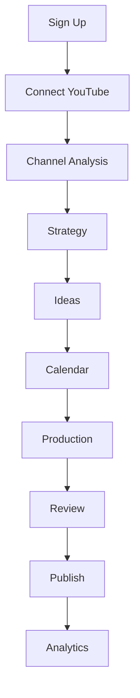
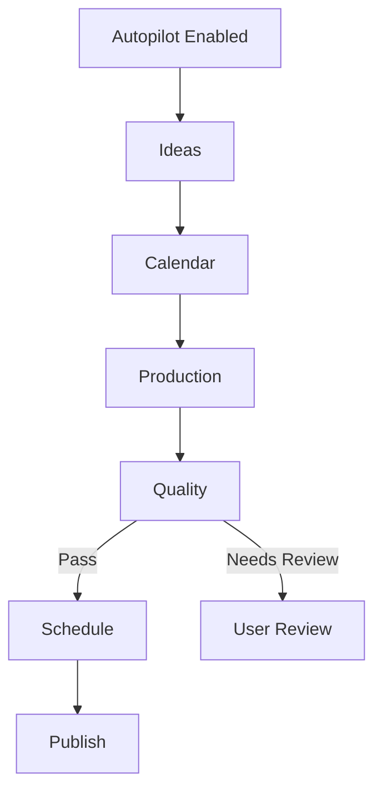

# Documento 08 — UX/UI, Jornada do Usuário e Control Center

## 1. Objetivo

Este documento define como toda a complexidade técnica da plataforma deverá ser traduzida em uma experiência simples, clara e confiável para o usuário final.

A plataforma deverá possuir dois ambientes distintos:

```text
USER APP
→ simples, clean, orientado a conteúdo e decisões

CONTROL CENTER
→ técnico, operacional, detalhado e administrativo
```

A regra principal é:

**o usuário deve enxergar decisões, progresso e resultados; não deve enxergar infraestrutura.**

---

# 2. Princípio de UX

A plataforma deverá reduzir a operação a poucas ações principais:

```text
Conectar canal
↓
Entender diagnóstico
↓
Aprovar estratégia
↓
Aprovar ideias/calendário
↓
Acompanhar produção
↓
Aprovar quando necessário
↓
Ver resultados
```

No Autopilot, ainda menos:

```text
Conectar
↓
Definir limites
↓
Acompanhar
```

---

# 3. Experiência Inicial

Primeiro acesso:

```text
Bem-vindo
↓
Criar organização
↓
Conectar YouTube
↓
Análise automática
↓
Diagnóstico
↓
Estratégia sugerida
↓
Calendário inicial
```

Evitar onboarding com dezenas de perguntas.

---

# 4. Regra de Inferência Primeiro

Antes de perguntar ao usuário:

```text
nicho
público
formato
frequência
tom
```

o sistema deverá tentar descobrir automaticamente.

Depois poderá pedir confirmação.

Exemplo:

```text
Identificamos seu canal como:
Entretenimento infantil

Público principal:
Pré-escolar

Conteúdos predominantes:
Música e histórias

Isso está correto?
```

---

# 5. Onboarding Progressivo

Fluxo visual:

```text
1. Conectar
2. Analisar
3. Entender
4. Planejar
5. Pronto
```

Não mostrar:

```text
Importando playlist
Rodando agent 4
Calculando embedding
```

---

# 6. Feedback Durante Análise

Exemplo:

```text
Analisando seu canal...

✓ Conteúdos identificados
✓ Padrões editoriais encontrados
● Entendendo audiência
○ Preparando estratégia
○ Criando primeiras sugestões
```

---

# 7. Empty States

Toda tela deverá possuir estado vazio útil.

Exemplo em Ideas:

```text
Ainda não há ideias sugeridas.

O sistema está analisando seu canal para encontrar novas oportunidades.
```

---

# 8. Estados de Loading

Nunca deixar tela sem resposta visual.

Usar:

```text
Analisando...
Preparando...
Produzindo...
Revisando...
Agendando...
```

---

# 9. Dashboard Principal

O dashboard deve responder rapidamente:

```text
O que está acontecendo hoje?
O que vem depois?
Existe algo que precisa de mim?
Como o canal está indo?
```

---

# 10. Estrutura do Dashboard

Sugestão:

```text
HEADER

Canal selecionado
Modo de automação
Status

TODAY
Conteúdos de hoje

NEXT
Próximas publicações

ACTION REQUIRED
Aguardando aprovação

OPPORTUNITIES
Novas sugestões

INSIGHTS
O que está funcionando
```

---

# 11. Exemplo Visual

```text
┌─────────────────────────────────────┐
│ Canal X                    Assisted │
├─────────────────────────────────────┤
│ Hoje                                │
│                                     │
│ 10:00 Short      ✓ Publicado       │
│ 15:00 Short      ● Produzindo      │
│ 19:00 Vídeo      ◷ Agendado        │
├─────────────────────────────────────┤
│ Precisa de você                     │
│                                     │
│ 2 conteúdos aguardando aprovação   │
│ [Revisar]                           │
├─────────────────────────────────────┤
│ Novas oportunidades                 │
│                                     │
│ 94  Tema A                          │
│ 91  Tema B                          │
│ 87  Tema C                          │
├─────────────────────────────────────┤
│ Insight                             │
│ Shorts de 20–30s estão +14%        │
└─────────────────────────────────────┘
```

---

# 12. Estados Visíveis Simplificados

Backend poderá possuir muitos estados.

A UI comum deverá usar:

```text
Ideia
Planejado
Produzindo
Revisão
Pronto
Agendado
Publicado
Falhou
```

---

# 13. Mapping de Estados

Exemplo:

```text
researching
scripting
storyboarding
generating
rendering
```

todos podem aparecer como:

```text
Produzindo
```

---

# 14. Detalhes Expansíveis

Usuário avançado poderá abrir:

```text
Roteiro concluído
Storyboard concluído
Cenas 8/10
Render em andamento
```

Mas isso não deve dominar a tela.

---

# 15. Navegação Principal

Menu sugerido:

```text
Dashboard
Ideias
Calendário
Conteúdos
Analytics
Canais
Configurações
```

---

# 16. Canais

Tela Channels deverá permitir:

```text
ver canais conectados
conectar novo canal
desconectar
pausar automação
alterar modo
ver status
```

---

# 17. Channel Card

```text
Canal X

YouTube

Status:
Saudável

Modo:
Semi-Auto

Próxima publicação:
Hoje 15:00

[Entrar]
```

---

# 18. Seletor de Canal

No topo da aplicação:

```text
Organization
↓
Channel Selector
```

Usuário alterna entre canais sem trocar contexto da conta.

---

# 19. Diagnóstico do Canal

Após onboarding, mostrar resumo:

```text
Nicho identificado
Público
Formatos
Pilares
Frequência atual
Frequência recomendada
Pontos fortes
Oportunidades
```

---

# 20. Não Exibir JSON

Channel DNA deverá ser traduzido em cards legíveis.

---

# 21. Estratégia

Tela Strategy deverá mostrar:

```text
Objetivo
Pilares
Mix de conteúdo
Frequência
Formatos
Experimental ratio
Recomendações
```

---

# 22. Estratégia em Cards

Exemplo:

```text
Conteúdo

Histórias        40%
Música           30%
Curiosidades     20%
Experimental     10%
```

---

# 23. Strategy Diff

Quando houver nova recomendação:

```text
Atual
vs
Sugerido
```

Exemplo:

```text
Shorts/dia
1 → 2

Motivo:
Shorts estão gerando 21% mais alcance.
```

---

# 24. Aprovação de Estratégia

No Assisted:

```text
[Manter atual]
[Aplicar recomendação]
```

---

# 25. Ideas

Tela de ideias deverá funcionar como backlog editorial.

Cada card:

```text
Score
Título
Resumo
Formato recomendado
Pilar
Motivo
```

---

# 26. Exemplo Idea Card

```text
94

Por que os tubarões não piscam?

Short • Curiosidades

Alta aderência ao canal e bom potencial de retenção.

[Adicionar ao calendário]
[Detalhes]
[Descartar]
```

---

# 27. Score Simples

Mostrar:

```text
94
```

Detalhes avançados:

```text
Channel Fit
Audience Fit
Trend
Retention
```

apenas ao expandir.

---

# 28. Ideias em Lote

Permitir:

```text
aprovar várias
descartar várias
adicionar ao calendário
```

sem microgerenciamento excessivo.

---

# 29. Filtros de Ideias

```text
Shorts
Vídeos
Pilar
Score
Origem
Status
```

---

# 30. Calendar

Calendário deverá ser uma das telas centrais.

Visualizações:

```text
Semana
Mês
Lista
```

---

# 31. Calendar Item

Mostrar:

```text
horário
formato
título
status
```

---

# 32. Drag-and-Drop

Pode ser adicionado quando estável.

Mover item deverá:

```text
revalidar conflitos
revalidar slot
persistir
```

---

# 33. Sugestão Visual

Itens sugeridos mas não aprovados deverão ter aparência distinta.

Exemplo:

```text
Sugestão IA
```

---

# 34. Calendar Conflicts

Exemplo:

```text
Este horário já possui outra publicação.
```

Oferecer:

```text
Mover automaticamente
Escolher horário
```

---

# 35. Content Projects

Tela Conteúdos:

```text
Todos
Produzindo
Revisão
Prontos
Agendados
Publicados
Falhos
```

---

# 36. Project Card

```text
Short

Tema X

Produzindo

Roteiro ✓
Mídia ●
QA ○

Publicação prevista:
Amanhã 10:00
```

---

# 37. Project Detail

Pode mostrar:

```text
Resumo
Roteiro
Storyboard
Assets
Qualidade
SEO
Publicação
Histórico
```

---

# 38. Tabs

Sugestão:

```text
Visão Geral
Roteiro
Cenas
Preview
SEO
Histórico
```

---

# 39. Preview

Sempre que conteúdo renderizado existir:

```text
video player
```

com ações:

```text
Aprovar
Solicitar ajuste
Regenerar
```

conforme permissão.

---

# 40. Revision UX

Usuário não deve precisar escrever prompt técnico.

Exemplo:

```text
O que deseja ajustar?

○ Roteiro
○ Cena
○ Voz
○ Thumbnail
○ Título
○ Outro
```

Pode escrever instrução natural.

---

# 41. Regeneration Warning

Se alteração invalidar etapas posteriores:

```text
Alterar o roteiro exigirá recriar storyboard e algumas cenas.
```

Mostrar impacto.

---

# 42. Cost Impact

Quando relevante:

```text
Custo estimado adicional: X
```

preferencialmente no modo avançado ou quando significativo.

---

# 43. Human Review Queue

Tela:

```text
Aguardando sua aprovação
```

Categorias:

```text
Estratégia
Calendário
Conteúdo
Problemas de qualidade
Orçamento
```

---

# 44. Review Card

```text
Vídeo X

Motivo:
Quality Score 82

Problema:
Voz apresentou falha em 00:18

Ação sugerida:
Substituir áudio

[Aplicar correção]
[Aprovar assim]
[Rejeitar]
```

---

# 45. Não Mostrar Erro Técnico Bruto

Usuário:

```text
Não conseguimos gerar esta cena.
```

Admin:

```text
PROVIDER_TIMEOUT MODEL_X ATTEMPT_2
```

---

# 46. Analytics

Tela deverá evitar virar BI excessivamente complexo inicialmente.

Priorizar:

```text
Views
Watch time
Retention
Subscribers
Performance vs baseline
Best content
Worst content
Insights
```

---

# 47. Analytics Overview

```text
Últimos 30 dias

Views
+18%

Subscribers
+7%

Conteúdos publicados
22

Performance Index
112
```

---

# 48. Content Performance

Tabela:

```text
Conteúdo
Formato
Publicado
Views
Performance Index
Status
```

---

# 49. Performance Index UX

Usar:

```text
Acima da média
Na média
Abaixo da média
```

com número opcional.

---

# 50. Insight Cards

```text
↑ O que está funcionando

Shorts com pergunta no início tiveram +13% de retenção.
```

---

# 51. Recomendações

```text
Recomendamos:
Produzir 2 Shorts semelhantes nesta semana.
```

---

# 52. Confidence UX

Não mostrar 0.8234.

Mostrar:

```text
Alta confiança
Média confiança
Baixa confiança
```

---

# 53. Trend UI

Tela/opção futura:

```text
Oportunidades em alta
```

---

# 54. Trend Card

```text
Tema X

Relevância para o canal:
Alta

Urgência:
Alta

Potencial:
91

[Adicionar]
```

---

# 55. Automation Mode Selector

Por canal:

```text
Manual
Assisted
Semi-Auto
Autopilot
```

---

# 56. Explicação

Cada modo deverá explicar:

```text
o que o sistema faz
o que precisa de aprovação
```

---

# 57. Assisted UX

Exemplo:

```text
A IA sugere e produz.
Você mantém aprovação das etapas principais.
```

---

# 58. Semi-Auto UX

```text
Você aprova estratégia e publicação.
A produção intermediária é automática.
```

---

# 59. Autopilot UX

```text
O sistema planeja, produz e publica dentro dos limites definidos.
```

---

# 60. Autopilot Setup

Antes de ativar:

```text
Frequência máxima
Custo máximo
Quality mínimo
Horários permitidos
Formatos permitidos
Auto Publish
```

---

# 61. Confirmação de Autopilot

Mostrar resumo:

```text
O sistema poderá publicar até:
2 Shorts/dia
3 vídeos/semana

Budget mensal:
R$ X

Quality mínimo:
90

[Ativar]
```

---

# 62. Emergency Pause

Botão visível:

```text
Pausar automações
```

---

# 63. Pause Confirmation

Não criar fricção excessiva.

Após pause:

```text
Novas produções e publicações automáticas foram pausadas.
```

---

# 64. Global Status

Dashboard deve mostrar:

```text
Autopilot saudável
```

ou:

```text
Atenção necessária
```

---

# 65. Health States

```text
Healthy
Attention
Paused
Critical
```

traduzidos para usuário.

---

# 66. Notifications

Centro de notificações:

```text
Conteúdo pronto
Publicação concluída
Erro de conexão
Budget chegando ao limite
Nova oportunidade
```

---

# 67. Notification Severity

```text
info
action required
warning
critical
```

---

# 68. Não Notificar Tudo

Evitar spam.

Eventos rotineiros podem ficar no feed.

---

# 69. Activity Feed

Dashboard poderá possuir:

```text
Atividade recente
```

Exemplo:

```text
09:20 Short publicado
08:52 Thumbnail aprovada
08:10 Nova ideia adicionada
```

---

# 70. Settings

Separar:

```text
Conta
Organização
Canais
Automação
Marca
Integrações
Billing
```

---

# 71. Brand Settings

Usuário poderá adicionar:

```text
logo
cores
referências
personagens
regras
```

---

# 72. Character Registry UI

Quando aplicável:

```text
Personagens
```

Cada personagem:

```text
Nome
Referências
Voz
Regras
Status
```

---

# 73. Character Card

```text
Tutú

Raposa bebê

4 referências visuais
1 voz

[Editar]
```

---

# 74. Reference Upload UX

Permitir:

```text
Frente
Lateral
Costas
Expressões
```

sem termos excessivamente técnicos.

---

# 75. Advanced Settings

Opções técnicas deverão ficar atrás de:

```text
Configurações avançadas
```

---

# 76. Proibição na UI Principal

Não mostrar por padrão:

```text
MCP
provider
model
temperature
tokens
Celery
Redis
workflow ID
correlation ID
```

---

# 77. Billing UX

Usuário deverá entender:

```text
Plano
Uso
Limites
Custo adicional
```

---

# 78. Não Expor Custo Técnico Cru

Preferir:

```text
Uso de geração
```

em vez de:

```text
$0.03782 fal.ai
```

exceto modo avançado/admin.

---

# 79. Usage Card

```text
Este mês

Shorts produzidos  38 / 60
Vídeos produzidos   7 / 10
Armazenamento       42%
```

---

# 80. Upgrade UX

Quando limite próximo:

```text
Você usou 80% do plano.
```

---

# 81. Team UX

Futuro:

```text
Membros
Roles
Invites
```

---

# 82. Roles

Interface deverá respeitar:

```text
owner
admin
editor
viewer
```

---

# 83. Viewer

Não verá ações destrutivas.

---

# 84. Editor

Pode trabalhar em conteúdos, mas talvez não billing/organization.

---

# 85. Responsividade

Aplicação deverá funcionar bem em:

```text
desktop
tablet
mobile
```

Mesmo que criação avançada seja otimizada para desktop.

---

# 86. Mobile Priorities

No mobile:

```text
aprovar
ver calendário
ver status
pausar automação
ver analytics
```

---

# 87. Accessibility

Implementar:

```text
keyboard navigation
labels
contrast
focus states
semantic HTML
```

---

# 88. Design System

Criar em:

```text
packages/ui
```

ou estrutura equivalente.

---

# 89. Tokens de Design

Definir:

```text
spacing
radius
typography
shadows
states
```

---

# 90. Cores

Usar design sóbrio e clean.

Não transformar interface em painel gamer de IA.

---

# 91. AI Presence

IA deverá aparecer como:

```text
assistência
insights
sugestões
```

não como dezenas de robôs/personas na UI.

---

# 92. Linguagem

Usuário vê:

```text
Analisando seu canal
```

não:

```text
Channel Analyst Agent executing
```

---

# 93. Explainability Drawer

Para quem quiser detalhes:

```text
Por que recomendamos isso?
```

---

# 94. Explainability Example

```text
Esta pauta foi recomendada porque:

• combina com seu pilar principal;
• temas semelhantes tiveram bom desempenho;
• ainda não foi explorada recentemente;
• possui uma janela de tendência favorável.
```

---

# 95. Control Center

Criar ambiente administrativo separado.

Rota conceitual:

```text
/admin
```

ou aplicação separada futuramente.

---

# 96. Control Center Purpose

Permitir operação técnica sem poluir UX comum.

---

# 97. Control Center Modules

```text
Overview
Organizations
Channels
Workflows
Jobs
Agents
Providers
Models
Costs
Quality
Publications
Errors
Feature Flags
Audit
```

---

# 98. Admin Overview

Mostrar:

```text
Active workflows
Failed jobs
Provider health
Today's spend
Publication failures
QA failures
```

---

# 99. Workflow Inspector

Tela:

```text
Workflow Run
```

Mostrar:

```text
definition
version
organization
channel
project
current step
timeline
cost
attempts
events
```

---

# 100. Step Inspector

Cada step:

```text
Input summary
Output summary
Agent
Status
Duration
Error
Retries
```

---

# 101. Agent Inspector

Mostrar:

```text
Agent
Version
Model
Prompt version
Runs
Success
Cost
Latency
Invalid outputs
QA approval
```

---

# 102. Prompt Inspector

Admin poderá futuramente:

```text
ver
comparar versões
ativar
rollback
```

---

# 103. Provider Dashboard

Mostrar:

```text
Provider
Status
Latency
Error rate
Spend
Balance
Models
```

---

# 104. Model Dashboard

```text
Model
Capability
Cost
Success
QA approval
Cost per approved asset
```

---

# 105. Generation Inspector

Mostrar:

```text
Generation
Attempts
Provider
Model
Input
Output
Cost
QA
```

---

# 106. Quality Dashboard

Mostrar:

```text
First-pass approval
Top issue types
Retry rate
Human review rate
```

---

# 107. Cost Dashboard

Mostrar:

```text
today
month
per organization
per channel
per project
per provider
per model
```

---

# 108. Publication Dashboard

Mostrar:

```text
scheduled
publishing
published
failed
```

---

# 109. Error Center

Centralizar erros.

Filtros:

```text
type
provider
workflow
organization
severity
status
```

---

# 110. Error Detail

Mostrar:

```text
error code
message
stack trace
workflow
correlation id
attempts
```

Somente admin.

---

# 111. Retry Action

Admin poderá:

```text
Retry step
Resume workflow
Cancel workflow
```

quando seguro.

---

# 112. Audit Log UI

Filtros:

```text
actor
action
resource
organization
date
```

---

# 113. Feature Flags UI

Admin poderá ativar/desativar:

```text
provider
autopilot
trend engine
router
```

sem deploy quando previsto.

---

# 114. Organization Support View

Admin poderá entrar em modo de suporte.

Sempre registrar auditoria.

---

# 115. Impersonation

Se implementado futuramente:

```text
read-only by default
```

e altamente auditado.

---

# 116. User Error Messages

Padrão:

```text
Título claro
Explicação humana
Próxima ação
```

---

# 117. Example

```text
Não conseguimos publicar este vídeo.

A conexão com o YouTube precisa ser renovada.

[Reconectar canal]
```

---

# 118. No Dead-End

Erro deve oferecer caminho.

---

# 119. Success Feedback

Exemplo:

```text
Calendário atualizado.
```

Evitar excesso de toast.

---

# 120. Confirmation Dialogs

Usar para ações de impacto:

```text
desconectar canal
cancelar conteúdo
ativar autopilot
excluir asset
```

---

# 121. Destructive Actions

Mostrar consequência claramente.

---

# 122. Autosave

Formulários editoriais deverão preferir autosave quando seguro.

---

# 123. Dirty State

Se não houver autosave:

```text
Alterações não salvas
```

---

# 124. Optimistic UI

Usar apenas quando rollback seguro.

---

# 125. Server Truth

Estados críticos devem vir do backend.

Não assumir sucesso só por frontend.

---

# 126. Real-Time Updates

Preparar SSE/WebSocket futuro para:

```text
generation progress
workflow status
publication status
```

---

# 127. MVP

Polling inteligente pode ser usado inicialmente.

---

# 128. Progress UX

Não inventar porcentagem falsa.

Se progresso real não existir:

```text
Produzindo cena 4 de 8
```

é melhor que:

```text
73%
```

sem base.

---

# 129. Skeletons

Usar para carregamentos de dados.

---

# 130. Tables

Tabelas administrativas deverão possuir:

```text
pagination
filters
sorting
search
```

---

# 131. Search

Pesquisa global futura:

```text
channels
projects
publications
```

---

# 132. User Search

Inicialmente pode ser específica por módulo.

---

# 133. URL State

Filtros relevantes deverão poder ser refletidos na URL.

---

# 134. Deep Links

Exemplo:

```text
/project/{id}
```

deve abrir contexto diretamente.

---

# 135. Breadcrumbs

Usar em telas profundas.

---

# 136. Permissions UX

Se usuário não possui acesso:

```text
Você não tem permissão para esta ação.
```

Não esconder toda a existência do recurso quando contexto exigir.

---

# 137. Channel Connection State

Estados:

```text
Connected
Needs Reauthorization
Syncing
Error
Disconnected
```

---

# 138. Reauthorization Banner

Quando OAuth expirar:

```text
Reconecte seu canal para continuar publicando.
```

---

# 139. Automation Safety Banner

Quando Autopilot pausado:

```text
Autopilot pausado por segurança.
Motivo: limite mensal atingido.
```

---

# 140. Budget Warning

```text
Você utilizou 80% do limite mensal.
```

---

# 141. Quality Warning

```text
3 conteúdos recentes precisaram de revisão manual.
```

---

# 142. Trust Indicators

Mostrar:

```text
Quality Score
Status
Última sincronização
```

onde útil.

---

# 143. Avoid Fake Precision

Usuário não precisa ver:

```text
Quality = 91.437
```

Usar:

```text
91
```

---

# 144. Tooltips

Para métricas menos óbvias.

---

# 145. First-Time Education

Pequenas explicações contextuais.

Evitar tour de 20 passos.

---

# 146. Progressive Disclosure

Mostrar o necessário.

Detalhes apenas sob demanda.

---

# 147. Copy Style

Interface deve utilizar linguagem:

```text
curta
clara
direta
não técnica
```

---

# 148. Proibido

Evitar textos como:

```text
A inteligência artificial generativa multagente...
```

na UI operacional.

---

# 149. Recommended

```text
Encontramos 6 novas ideias para seu canal.
```

---

# 150. Multi-Language

Preparar i18n.

Idioma inicial pode ser:

```text
pt-BR
```

mas não hardcode textos em componentes.

---

# 151. Dates

Respeitar timezone do usuário/canal.

---

# 152. Numbers

Localizar:

```text
1.234,56
```

quando pt-BR.

---

# 153. UX Metrics

Preparar eventos internos para medir:

```text
time to connect channel
time to first strategy
ideas approved
calendar approvals
manual interventions
```

---

# 154. Product Metrics

Exemplos:

```text
Activation:
user connected channel + approved first calendar

Time to Value:
time until first useful recommendation

Autonomy:
% content without intervention
```

---

# 155. Friction Detection

Se usuários sempre editam uma mesma sugestão:

```text
possible product/agent issue
```

---

# 156. User Feedback

Permitir feedback simples:

```text
Útil
Não útil
```

em insights e ideias.

---

# 157. Rejection Reason

Ao rejeitar ideia, opcionalmente:

```text
Repetitiva
Fora do canal
Não gostei
Muito cara
Outro
```

---

# 158. Feedback Integration

Esses dados poderão alimentar Learning Engine futuramente.

---

# 159. Accessibility of Automation

Usuário deve sempre saber:

```text
quem controla a próxima ação
```

Exemplo:

```text
Aguardando você
```

ou:

```text
O sistema continuará automaticamente
```

---

# 160. Next Action Label

Cada projeto pode possuir:

```text
next_action
```

traduzido para UX.

---

# 161. Example

```text
Próxima etapa:
Revisão automática
```

---

# 162. Avoid Ambiguous Waiting

Não usar apenas:

```text
Pendente
```

quando puder informar motivo.

---

# 163. Detail Timeline

Project Detail poderá mostrar:

```text
Ideia aprovada
Roteiro criado
Storyboard concluído
Vídeo gerado
QA aprovado
SEO pronto
```

---

# 164. Audit vs User Timeline

User timeline é simplificada.

Admin timeline é completa.

---

# 165. Drafts

Conteúdos não aprovados devem poder permanecer em Draft sem aparecer no calendário publicado.

---

# 166. Archive

Ideias e projetos antigos poderão ser arquivados.

---

# 167. Delete

Preferir archive/soft delete.

---

# 168. Global Command Palette

Futuro:

```text
Conectar canal
Criar ideia
Abrir calendário
Pausar automação
```

---

# 169. Keyboard Shortcuts

Opcional, não MVP.

---

# 170. Desktop Layout

Sugestão:

```text
Sidebar
Topbar
Main content
Optional context panel
```

---

# 171. Sidebar

```text
Dashboard
Ideas
Calendar
Content
Analytics

---
Channels
Settings
```

---

# 172. Topbar

```text
Channel selector
Automation status
Notifications
User menu
```

---

# 173. Context Panel

Pode mostrar detalhes rápidos sem navegar.

---

# 174. Mobile Layout

Bottom navigation ou compact menu.

---

# 175. MVP Screens

Obrigatórias:

```text
Login
Onboarding
Connect Channel
Channel Analysis
Dashboard
Ideas
Calendar
Content List
Content Detail
Analytics
Channel Settings
Automation Settings
General Settings
```

---

# 176. Phase-Based UI

Não criar telas vazias para fases futuras.

Adicionar conforme funcionalidade existe.

---

# 177. Feature Flag UX

Se feature desabilitada:

```text
ocultar
```

ou mostrar:

```text
Em breve
```

somente quando fizer sentido comercial.

---

# 178. Control Center MVP

Pode começar com:

```text
Overview
Jobs
Workflows
Providers
Errors
```

e crescer.

---

# 179. User App vs Admin App

Idealmente compartilhar:

```text
design system
auth primitives
API client
```

mas separar responsabilidades.

---

# 180. API Client

Frontend deverá usar cliente central.

---

# 181. Query Layer

Usar TanStack Query ou equivalente.

---

# 182. Forms

Usar schemas compartilhados quando possível.

---

# 183. Validation

Mostrar erro próximo ao campo.

---

# 184. Server Validation

Frontend validation não substitui backend.

---

# 185. Upload UI

Para assets:

```text
drag & drop
preview
progress
validation
```

---

# 186. File Validation

Mostrar:

```text
tipo não suportado
arquivo muito grande
```

em linguagem simples.

---

# 187. Preview Safety

Não executar conteúdo arbitrário enviado.

---

# 188. Thumbnail Selection

Mostrar candidatos lado a lado.

---

# 189. Title Selection

Pode mostrar:

```text
Título A 93
Título B 89
Título C 84
```

com explicação opcional.

---

# 190. SEO Editor

Usuário poderá editar:

```text
title
description
hashtags
```

antes da publicação.

---

# 191. Manual Override Indicator

Se editar:

```text
Editado por você
```

---

# 192. Preserve AI Version

Não sobrescrever candidato original.

---

# 193. Publication Preview

Antes de publicar manualmente:

```text
thumbnail
title
description
date/time
visibility
```

---

# 194. Final Confirmation

No Manual/Assisted:

```text
[Publicar]
```

ou:

```text
[Agendar]
```

---

# 195. Scheduled Content

Permitir reagendar antes do upload/publicação quando possível.

---

# 196. Cancel Publication

Ação clara.

---

# 197. Published Content

Depois de publicado:

```text
Abrir no YouTube
Ver analytics
```

---

# 198. Platform Links

Abrir recurso externo em nova aba.

---

# 199. UI Performance

Não carregar thumbnails/vídeos gigantes sem otimização.

---

# 200. Lazy Loading

Para listas de mídia.

---

# 201. Image Optimization

Usar recursos do framework.

---

# 202. Video Preview

Preferir proxies/preview quando apropriado.

---

# 203. Error Boundaries

Frontend deverá possuir boundaries para falhas locais.

---

# 204. Global Error Screen

Com:

```text
Tentar novamente
Voltar ao dashboard
```

---

# 205. Offline/Connectivity

Mostrar:

```text
Sem conexão
```

quando necessário.

---

# 206. Session Expiry

Fluxo amigável de login novamente.

---

# 207. Security UI

Sessões e canais conectados deverão ser gerenciáveis.

---

# 208. Disconnect Channel

Explicar:

```text
A plataforma deixará de sincronizar e publicar neste canal.
Conteúdos já criados não serão apagados.
```

---

# 209. Delete Organization

Futuro, fluxo forte de confirmação.

---

# 210. User Trust

Nunca sugerir que uma ação ocorreu se backend ainda não confirmou.

---

# 211. Optimistic Publishing Proibido

Não mostrar:

```text
Publicado
```

até confirmação externa.

---

# 212. Status Source

Frontend deve usar status do backend.

---

# 213. Reconciliation UX

Se status incerto:

```text
Confirmando publicação...
```

---

# 214. Provider Outage UX

Usuário não precisa saber provider.

Mostrar:

```text
Uma etapa de geração está demorando mais que o normal.
O sistema está tentando uma alternativa.
```

---

# 215. Admin Outage UX

Control Center mostra provider específico.

---

# 216. Cost UX no Autopilot

Mostrar:

```text
Budget mensal
Consumido
Projetado
```

---

# 217. Forecast

Exemplo:

```text
Uso projetado:
74% do limite
```

---

# 218. High Spend Warning

```text
No ritmo atual, seu limite pode ser atingido antes do fim do mês.
```

---

# 219. Usage Explainability

Mostrar quais tipos de conteúdo consomem mais.

---

# 220. User Control

Usuário sempre poderá:

```text
pausar
editar limites
desativar auto publish
mudar modo
```

---

# 221. Autopilot Trust Ladder

Pode mostrar histórico:

```text
Últimos 30 conteúdos
27 publicados sem intervenção
3 revisados
0 falhas críticas
```

---

# 222. Autonomy Rate UX

```text
90% automatizado
```

opcional.

---

# 223. Health Dashboard

Exemplo:

```text
Canal
Saudável

Conexão
✓

Calendário
✓

Produção
✓

Budget
✓
```

---

# 224. User UI Philosophy

A aplicação deverá parecer:

```text
editorial operating system
```

e não:

```text
AI engineering console
```

---

# 225. Control Center Philosophy

O admin deverá enxergar:

```text
everything required to diagnose and recover operation
```

---

# 226. Phase Mapping

Principalmente:

```text
F01
Design system foundation

F03
Login/Auth UX

F04
Channel connection

F05–07
Onboarding and diagnosis

F08–10
Strategy/Ideas/Calendar

F11–16
Project status/Review

F17
SEO/Thumbnail

F18
Scheduling/Publishing

F19
Analytics/Insights

F20
Autopilot/Billing/Admin
```

---

# 227. Definition of Done — User Feature

Uma feature de usuário só é considerada pronta quando possui:

```text
loading state
empty state
success state
error state
permission state
mobile behavior
accessibility basics
```

---

# 228. Definition of Done — Async Feature

Também precisa:

```text
progress/status
retry path
human-readable error
```

---

# 229. Definition of Done — Admin Feature

Deve permitir:

```text
identify resource
inspect status
inspect correlation
understand failure
perform allowed recovery
```

---

# 230. Component Documentation

Manter:

```text
/docs/ui.md
```

com:

```text
navigation
design system
status mappings
main flows
screens
permissions
```

---

# 231. User Flow Diagrams

Manter Mermaid.

Exemplo:



---

# 232. Automation Flow UX



---

# 233. UX Acceptance Tests

Criar testes E2E para:

```text
first login
connect channel
complete onboarding
approve idea
approve calendar
open project
approve content
schedule publication
pause autopilot
```

---

# 234. Golden UX Case

Novo usuário deverá conseguir chegar de:

```text
account created
```

até:

```text
first content plan
```

sem precisar entender IA ou APIs.

---

# 235. Maximum Cognitive Load

Evitar exigir muitas decisões simultâneas.

---

# 236. Recommended Default

Sistema deve sugerir defaults fortes.

Exemplo:

```text
Modo recomendado:
Assisted
```

---

# 237. Safe Defaults

Auto Publish:

```text
OFF
```

para canal novo.

---

# 238. User Confirmation

Antes de ativar publicação automática:

```text
explicit confirmation
```

---

# 239. Progressive Automation

UX deverá estimular caminho:

```text
Assisted
↓
Semi-Auto
↓
Autopilot
```

somente quando usuário quiser.

---

# 240. Final User Experience

A experiência ideal deverá ser:

```text
Conectei meu canal.

O sistema entendeu meu conteúdo.

Ele me mostrou o que está funcionando.

Sugeriu o que publicar.

Organizou meu calendário.

Produziu os conteúdos.

Pediu minha aprovação apenas quando necessário.

Publicou.

Depois me explicou o que funcionou e ajustou as próximas sugestões.
```

---

# 241. Final Admin Experience

O administrador deverá conseguir:

```text
ver
rastrear
diagnosticar
corrigir
pausar
retomar
comparar
auditar
```

toda a operação da plataforma.

---

# 242. Regra Final

Se uma funcionalidade exigir que o usuário final entenda:

```text
MCP
provider
model
retry
queue
worker
prompt version
```

para conseguir utilizá-la, a experiência não está suficientemente abstraída.

O usuário deve operar **objetivos e decisões editoriais**.

A plataforma deve operar **infraestrutura, agentes e automações**.

Este documento deverá permanecer como referência obrigatória durante todas as fases de frontend, onboarding, UX, dashboard, calendário, revisão, analytics, Autopilot e Control Center.