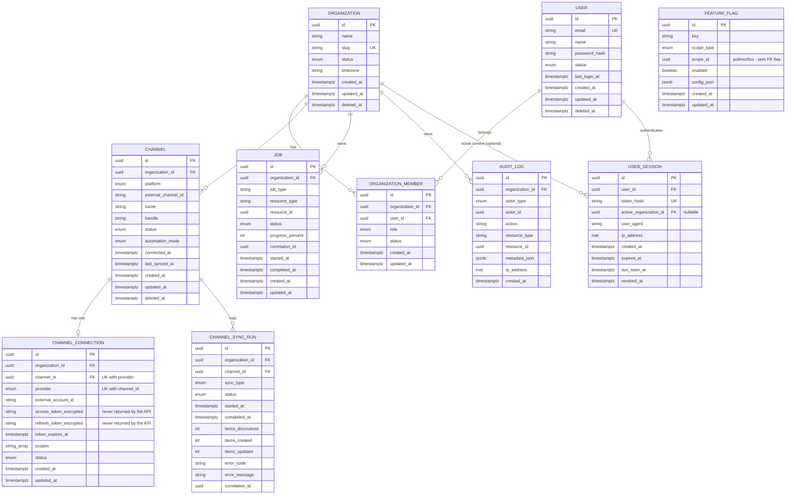

# Database — Estado Atual do Schema

> Mantido conforme Documento 03, seção 133. Atualizar a cada fase que alterar o domínio.

Última atualização: Fase 04 — YouTube Integration.

## ERD

`FEATURE_FLAG` fica fora do diagrama de relacionamentos porque `scope_id` é polimórfico (aponta para `organizations.id` ou `channels.id` dependendo de `scope_type`, ou é nulo quando `scope_type=global`) — não tem FK fixa de propósito (Documento 03, seção 85).

`USER_SESSION` (tabela `sessions`) pertence a um `USER`, não a uma organização fixa — `active_organization_id` é o contexto de organização atual da sessão e pode mudar (endpoint `POST /auth/organization`), nunca uma FK obrigatória.

## Entidades por fase (o que já existe)

| Fase | Entidades | Status |
|---|---|---|
| 01 | — (nenhuma entidade de domínio) | ✅ |
| 02 | `organizations`, `users`, `organization_members`, `channels`, `jobs`, `feature_flags`, `audit_logs` | ✅ |
| 03 | `sessions` (modelo `UserSession`) | ✅ |
| 04 | `channel_connections`, `channel_sync_runs` | ✅ |
| 05+ | `source_videos`, `source_playlists`, `source_video_metrics`, ... | ⏳ |

Ver Documento 03, seções 110-129 para o mapeamento completo fase → entidades. `sessions` não está no Documento 03 (que deixa "sessions/tokens conforme implementação" em aberto — Documento 10 §112) — modelada aqui seguindo os campos exatos do Documento 09 §6 (`session_id`, `user_id`, `created_at`, `expires_at`, `last_seen_at`, `revoked_at`).

## Decisões de modelagem (Fase 02)

- **Enums:** `native_enum=False` em todos (armazenados como `VARCHAR` com `CHECK`, não `ENUM` nativo do Postgres) — evita o custo de `ALTER TYPE ADD VALUE` sempre que um novo valor de status for necessário em fases futuras.
- **Soft delete:** aplicado em `organizations`, `users`, `channels` (entidades "críticas" segundo Documento 02, seção 14). `organization_members`, `jobs`, `feature_flags` não têm — não são entidades de negócio de longa duração da mesma forma. `audit_logs` é append-only por definição (Documento 03, seção 102), sem `updated_at`/`deleted_at`.
- **`channels.status`** (`pending | active | disabled`) é uma decisão desta fase — o Documento 03 não especifica os valores exatos, só cita o campo. Representa o ciclo de vida do *registro* do canal na plataforma, distinto do status da *conexão OAuth* (`channel_connections.status`, que chega na Fase 04).
- **`channels` unique constraint** (`organization_id + platform + external_channel_id`) é um índice único parcial (`WHERE external_channel_id IS NOT NULL`), já que canais "placeholder" criados nesta fase ainda não têm `external_channel_id`.
- **Repositórios:** `TenantScopedRepository` nunca expõe `get_by_id`/`list` sem `organization_id` obrigatório — única forma de acessar entidades escopadas (Documento 02, seção 11). `BaseRepository` (sem escopo) é usado apenas para `Organization`, `User` e `UserSession`, que não são escopados por uma única organização fixa.

## Decisões de modelagem (Fase 03)

- **`users.status`** novo usuário nasce `active` (não `pending`) — não existe ainda fluxo de verificação de e-mail (Documento 09, seção 142, é opcional e não implementado nesta fase).
- **Sessões DB-backed, não JWT stateless.** Segue Documento 09 §6 e o princípio geral "estado vive no Postgres" (Documento 02 §21). Um token opaco de alta entropia (`secrets.token_urlsafe(32)`) é gerado no login/registro; só o hash SHA-256 é persistido (nunca o token puro — mesmo princípio de nunca guardar segredo em texto). Isso permite revogação real (`logout`, futura "logout de todos os dispositivos"), que um JWT auto-contido não permitiria sem uma blocklist.
- **Registro cria organização automaticamente.** Cada novo usuário vira `owner` de uma organização nova no `POST /auth/register` (Documento 08 §3: "Criar organização" é o primeiro passo após o cadastro). Não há fluxo de "entrar em organização existente" nesta fase (convite de membros fica para fase futura).
- **`AuthorizationService` + `Permission` (coarse-grained).** `app/domain/permissions.py` mapeia os 4 roles do Documento 09 §12 para um conjunto fixo de permissões (não o modelo granular por-recurso do Documento 09 §17, que é explicitamente "preparar para o futuro"). Owner tem tudo; Admin tem tudo exceto billing/org settings; Editor tem conteúdo; Viewer só leitura.
- **Rate limiting de login** via Redis (`app/security/rate_limit.py`) — 5 tentativas por e-mail em 15 min, depois `429`. Redis é usado só como contador (nunca fonte de verdade), conforme Documento 02 §21.
- **Nenhum endpoint de negócio novo além de auth.** `POST /organizations`, `POST /channels` etc. continuam não expostos — isso pertence às fases que de fato precisam deles, agora com autenticação e `require_permission` disponíveis para protegê-los.

## Decisões de modelagem (Fase 04)

- **`channel_connections` unique constraint** em `(channel_id, provider)` — um canal só pode ter uma conexão ativa por provider (hoje só `google_youtube`), mas a estrutura já comporta múltiplos providers por canal no futuro.
- **Tokens sempre criptografados em repouso** (`app/security/encryption.py`, Fernet, chave via `TOKEN_ENCRYPTION_KEY` — nunca no banco). A API nunca devolve `access_token_encrypted`/`refresh_token_encrypted` em nenhuma resposta (testado explicitamente em `test_channels_endpoints.py`).
- **`YouTubeGateway` com duas implementações**: `GoogleYouTubeGateway` (real, via `httpx`, chama os endpoints OAuth2/YouTube Data API v3 do Google) e `FakeYouTubeGateway` (determinística, sem rede — Documento 02 §71). A escolha é via `Settings.youtube_fake_gateway` (`YOUTUBE_FAKE_GATEWAY=true` por padrão). O `FakeYouTubeGateway` aponta a "authorization_url" para o próprio callback do frontend (com um `code` falso já embutido), então o fluxo de conexão é clicável de ponta a ponta no navegador sem precisar de uma conta Google real.
- **State OAuth assinado, sem storage.** `app/security/signed_state.py` gera um token HMAC-SHA256 (stdlib puro, sem nova dependência) contendo `organization_id` + `user_id` + expiração — a validação no callback é 100% stateless e detecta adulteração/expiração. O usuário autenticado no callback precisa bater com o `user_id` do state (`STATE_USER_MISMATCH` se não bater).
- **`channel_sync_runs` na Fase 04** grava só o tipo `INITIAL` (a conexão em si) — importação de vídeos/playlists (`FULL`/`INCREMENTAL`) é Fase 05 (Channel Importer), conforme Documento 03 §113-114.
- **Upsert por `external_channel_id`**: reconectar um canal já existente (mesmo `organization_id` + `platform` + `external_channel_id`) atualiza o registro existente em vez de duplicar — cobre tanto reconexão quanto refresh de metadata.
- **Bug real encontrado via teste:** `TenantScopedRepository.add()`/`BaseRepository.add()` fazem `session.flush()` imediatamente. Construir uma entidade com campos `NOT NULL` ainda vazios e só preenchê-los *depois* de chamar `.add()` quebra com `IntegrityError`. Corrigido usando `session.add()` (sem flush) nesses dois pontos específicos do `ChannelConnectionService`, e documentado aqui para não se repetir em fases futuras: **sempre preencher os campos obrigatórios antes de persistir, ou usar `session.add()` cru quando precisar de duas etapas.**
