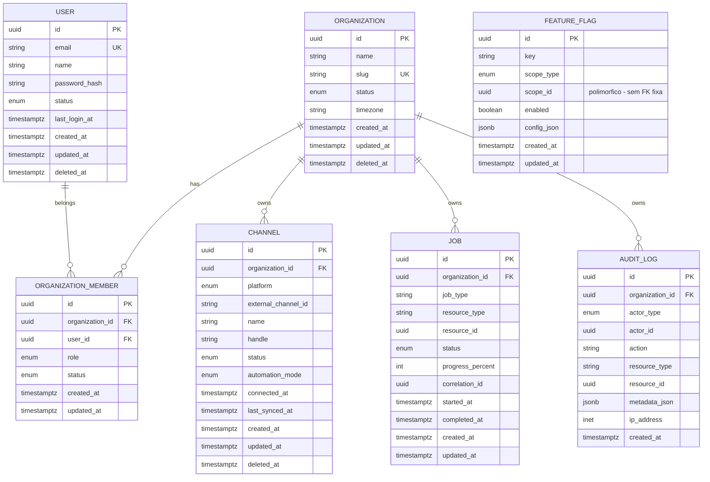

# Database — Estado Atual do Schema

> Mantido conforme Documento 03, seção 133. Atualizar a cada fase que alterar o domínio.

Última atualização: Fase 02 — Core Domain & Database.

## ERD

`FEATURE_FLAG` fica fora do diagrama de relacionamentos porque `scope_id` é polimórfico (aponta para `organizations.id` ou `channels.id` dependendo de `scope_type`, ou é nulo quando `scope_type=global`) — não tem FK fixa de propósito (Documento 03, seção 85).

## Entidades por fase (o que já existe)

| Fase | Entidades | Status |
|---|---|---|
| 01 | — (nenhuma entidade de domínio) | ✅ |
| 02 | `organizations`, `users`, `organization_members`, `channels`, `jobs`, `feature_flags`, `audit_logs` | ✅ |
| 03+ | `channel_connections`, `channel_sync_runs`, ... | ⏳ |

Ver Documento 03, seções 110-129 para o mapeamento completo fase → entidades.

## Decisões de modelagem (Fase 02)

- **Enums:** `native_enum=False` em todos (armazenados como `VARCHAR` com `CHECK`, não `ENUM` nativo do Postgres) — evita o custo de `ALTER TYPE ADD VALUE` sempre que um novo valor de status for necessário em fases futuras.
- **Soft delete:** aplicado em `organizations`, `users`, `channels` (entidades "críticas" segundo Documento 02, seção 14). `organization_members`, `jobs`, `feature_flags` não têm — não são entidades de negócio de longa duração da mesma forma. `audit_logs` é append-only por definição (Documento 03, seção 102), sem `updated_at`/`deleted_at`.
- **`channels.status`** (`pending | active | disabled`) é uma decisão desta fase — o Documento 03 não especifica os valores exatos, só cita o campo. Representa o ciclo de vida do *registro* do canal na plataforma, distinto do status da *conexão OAuth* (`channel_connections.status`, que chega na Fase 04).
- **`channels` unique constraint** (`organization_id + platform + external_channel_id`) é um índice único parcial (`WHERE external_channel_id IS NOT NULL`), já que canais "placeholder" criados nesta fase ainda não têm `external_channel_id`.
- **`users.status`** novo usuário nasce `active` (não `pending`) nesta fase, por não existir ainda fluxo de verificação de e-mail (Documento 09, seção 142, é opcional e chega com a Fase 03 — Authentication).
- **Repositórios:** `TenantScopedRepository` nunca expõe `get_by_id`/`list` sem `organization_id` obrigatório — única forma de acessar entidades escopadas (Documento 02, seção 11). `BaseRepository` (sem escopo) é usado apenas para `Organization` e `User`, que são as raízes do tenant.
- **Senha:** hashing via `bcrypt` (`app/security/password.py`). Login/sessão ainda não existem — chegam na Fase 03.
